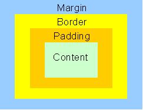

By default a page will be laid out by the browser as a left-to-right, top-to-bottom vertical flow based on the size of content and space available.



Every element is comprised of a box.

The box has four components:
* content: the elements inside a container.
* padding: transparent area surrounding the content.
* border: a border surrounding the padding.
* margin: transparent area outside the border.

Content has a `height` and a `width` property.

The other components can use `top`, `bottom`, `left`, and `right` properties, which set their respective properties in the appropriate direction.

If you were trying to calculate the total width of an element it would be:

```
totalWidth = Content(width)
+ (paddingLeft + paddingRight)
+ (borderLeft + borderRight)
+ (marginLeft + marginRight).
```

Height would be the same formula using Content height and the appropriate top and bottom properties of the other elements.

> ### Skill++
> The W3C recommendation says that `width` is a property of the box's content.
>
> Earlier versions of Internet Explorer (in use around the early to mid-2000's) considered the _width_ to be _content_ + _padding_ + _border_.
>
> This issue, known as the _Internet Explorer box model bug_, required developers to implement "hacks" to make Internet Explorer comply with the W3C box model.

`padding: 25px;` creates 25 pixels of padding on all four sides.

`padding-top: 25px;` creates 25 pixels of padding only above an element.

`padding-bottom: 25px;` creates 25 pixels of padding only below an element.

`padding-left: 25px;` creates 25 pixels of padding only above an element.

`padding-right: 25px;` creates 25 pixels of padding only below an element.

`padding: 25px 50px;` creates 25 pixels of padding above and below (top and bottom), and 50 pixels of padding left and right.

`padding: 25px 50px 75px;` creates 25 pixels of padding above, 50 pixels of padding left and right, and 75 pixels of padding below.

`padding: 10px 20px 30px 40px;` creates 10, 20, 30, and 40 pixels of padding on the top, right, bottom, and left.


```html
<html>
   <head>
      <title> Border, Margin, Padding </title>
      <link rel="stylesheet" type="text/css" href="myStyles.css" />
   </head>

   <body>
      <h1> Box Model: Border, Margin, Padding </h1>

      <div id="topDiv"> Top Div </div>

      <br>

      <span id="span1"> First Span </span>
      <span id="span2"> Second Span </span>
      <span id="span3"> Third Span </span>

      <br>

      <div id="bottomDiv"> Bottom Div </div>
   </body>
</html>
```

```css
div, span {
   border-style: solid;
   border-width: 1px;
}

#topDiv {
   border-color: red;
}

#bottomDiv {
   border-color: purple;
}

#span1 {
   border-color: orange;
}

#span2 {
   border-color: green;
   margin-left: 10px;
   margin-top: 10px;
   padding-right: 10px;
   padding-left: 50px;
   padding-top: 10px;
}

#span3 {
   border-color: blue;
}
```

<hr>

[Prev](cssMoreSelectors.md) -- [Up](README.md) -- [Next](cssPositionRelative.md)

