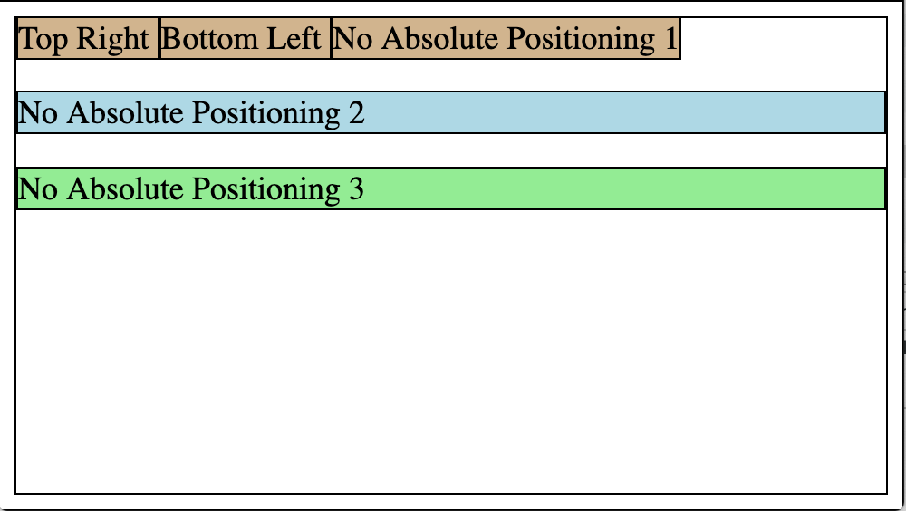

### `position: absolute` Property:

When setting a tag to `position: absolute;`, we are setting that tag to an absolute position within its nearest ancester that is also set to `position: absolute;`.
If no ancesters are set to `position: absolute`, then it is absolute within the entire page.

When setting a tag to `position: absolute;`, we also set `top`, `bottom`, `left`, and / or `right`.

When setting a tag to `position: absolute;`, other elements are positioned as if the `absolute` element is NOT present.

```html
<html>
   <head>
      <title> Absolute Position </title>
      <link rel="stylesheet" type="text/css" href="myStyles.css" />
   </head>

   <body>
      <span class="topRight"> Top Right </span>
      <span class="bottomLeft"> Bottom Left </span>
      <span> No Absolute Positioning 1 </span>
      <p> No Absolute Positioning 2 </p>
      <div> No Absolute Positioning 3 </div>
   </body>
</html>
```



```css
.bottomLeft {
   position: absolute;
   bottom: 0;
   left: 100px;
}

.topRight {
   position: absolute;
   top: 0;
   right: 0;
}
```


For a more thorough discussion, watch https://www.youtube.com/watch?v=wmAP2xvNs08

<hr>

[Prev](cssPositionRelative.md) -- [Up](README.md) -- [Next](cssPositionFixed.md)

