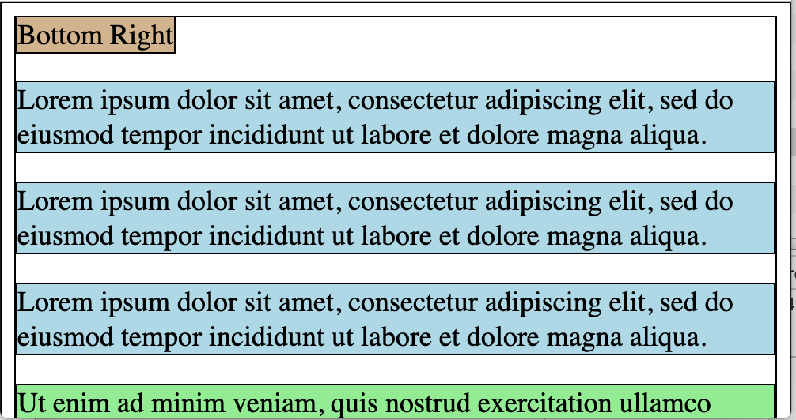
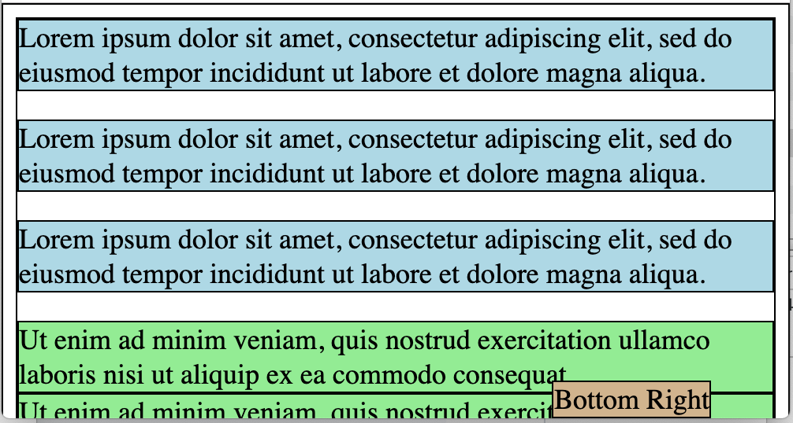
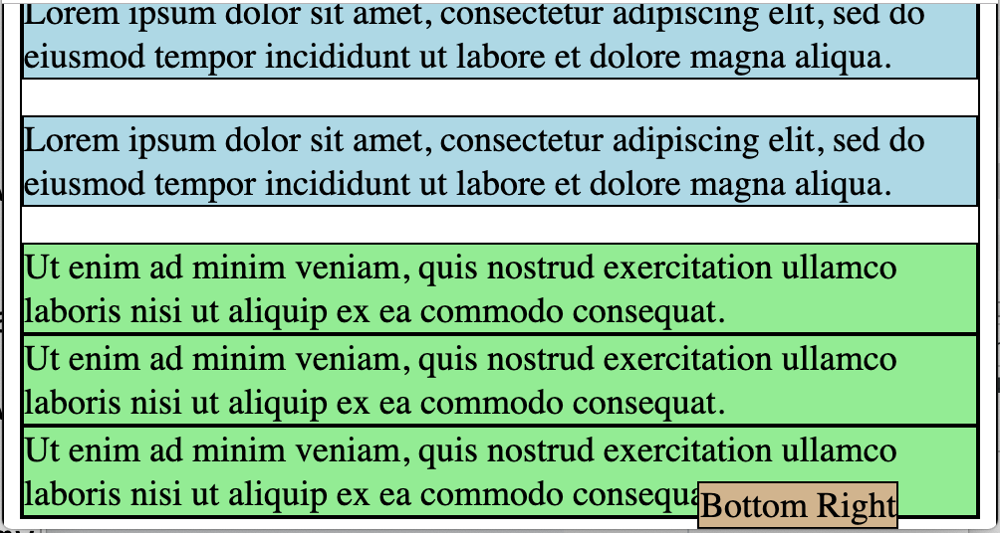

### `position: fixed` Property:

When setting a tag to `position: fixed;`, it is setting that tag to a fixed position on the screen.
That position is in relationship to the `top`, `bottom`, `left`, and/or `right` of the screen.

When setting a tag to `position: fixed;`, we also set `top`, `bottom`, `left`, and / or `right`.

```html
<html>
   <head>
      <title> Fixed Position </title>
      <link rel="stylesheet" type="text/css" href="myStyles.css" />
   </head>

   <body>
      <span class="bottomRight"> Bottom Right </span>
      <p> Lorem ipsum dolor sit amet, consectetur adipiscing elit, sed do
          eiusmod tempor incididunt ut labore et dolore magna aliqua. </p>
      <p> Lorem ipsum dolor sit amet, consectetur adipiscing elit, sed do
          eiusmod tempor incididunt ut labore et dolore magna aliqua. </p>
      <p> Lorem ipsum dolor sit amet, consectetur adipiscing elit, sed do
          eiusmod tempor incididunt ut labore et dolore magna aliqua. </p>
      <div>Ut enim ad minim veniam, quis nostrud exercitation ullamco laboris
           nisi ut aliquip ex ea commodo consequat.</div>
      <div>Ut enim ad minim veniam, quis nostrud exercitation ullamco laboris
           nisi ut aliquip ex ea commodo consequat.</div>
      <div>Ut enim ad minim veniam, quis nostrud exercitation ullamco laboris
           nisi ut aliquip ex ea commodo consequat.</div>
   </body>
</html>
```



```css
.bottomRight {
   position: fixed;
   bottom: 0;
   right: 50px;
}
```



Scrolling the page doesn't moved the fixed element.




<hr>

[Prev](cssPositionAbsolute.md) -- [Up](README.md) -- [Next](cssDisplay.md)

