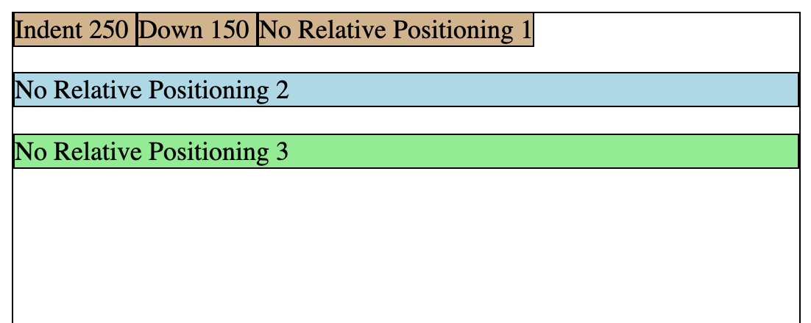
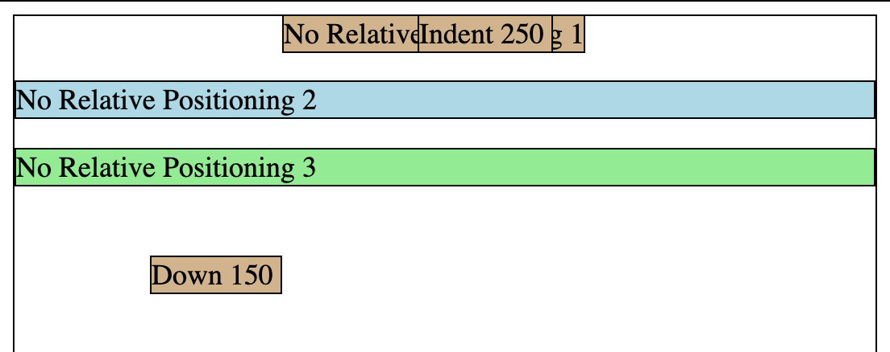

### `position: relative` Property:

If we specify that an element is `position: relative;`, then it is positioned relative to where it **would have been**.

If we specify that an element is `position: relative;` then we should also specify `top`, `bottom`, `left`, and / or `right`.

If we specify that an element is `position: relative;`, then the browser treats the rest of the elements **as if the relative element were in it's original place**.

```html
<html>
   <head>
      <title> Relative Position </title>
      <link rel="stylesheet" type="text/css" href="myStyles.css" />
   </head>

   <body>
      <span class="indent250"> Indent 250 </span>
      <span class="down350"> Down 350 </span>
      <span> No Relative Positioning 1 </span>
      <p> No Relative Positioning 2 </p>
      <div> No Relative Positioning 3 </div>
   </body>
</html>
```



```css
.indent250 {
   position: relative;
   left: 250px;
}

.down350 {
   position: relative;
   top: 350px;
}
```



**Question**: Why does the `No Relative Positioning 1` element look sooooo jacked up?

<details>
  <summary> Answer </summary>
   The browser treats the first two <code>&lt;span&gt;</code>s as if they were in their original place.
  <code>&lt;span&gt;</code> tags are placed side-by-side.
  Therefore, the third <code>&lt;span&gt;</code> is placed immediately after where the first two <code>&lt;span&gt;</code>s <strong>would have gone</strong>.
</details>

<hr>

[Prev](cssBoxModel.md) -- [Up](README.md) -- [Next](cssPositionAbsolute.md)

