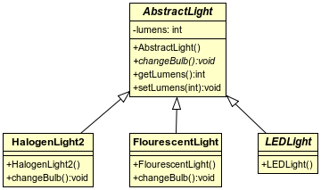

A subclass inherits the methods of its superclass and can choose which methods to override.

```java
public class Light {
  public void changeBulb() {
    // subclasses should override this method
  }
}
```

```java
class HalogenLight1 extends Light {
  // no override.
}
```

The `abstract` modifier declares a class as an _abstract class_.

  ```java
  public abstract class AbstractLight {
    // subclasses MUST implement this method
    public abstract void changeBulb();
  }
  ```

* An `abstract` class cannot directly be instantiated.

  ```java
  Light light = new Light();                  // Just fine.
  AbstractLight alight = new AbstractLight(); // WILL NOT COMPILE
                                              // Cannot instantiate the type AbstractLight
  ```
  * A non-`abstract` class - a class that can be directly instantiated with `new` - is called a _concrete class_.

* The order of modifiers in a class declaration is irrelevant.

  ```java
  abstract public class AbstractLight { /*...*/ }
  ```

_Concrete_ subclasses of an `abstract` class _must_ implement (provide code for) its `abstract` methods.

```java
public class HalogenLight2 extends AbstractLight {
  @Override
  public void changeBulb() {
    System.out.println("Change bulb in halogen light");
    System.out.println("Don't touch the bulb with your bare hands");
  }
}
```

```java
public class FlourescentLight extends AbstractLight {
  @Override
  public void changeBulb() {
    System.out.println("Change tube in fluorescent lamp.");
    System.out.println("Dispose of old tube properly.");
  }
}
```

```java
public class LEDLight extends AbstractLight {
  // WILL NOT COMPILE
  // The type LEDLight must implement the inherited abstract method AbstractLight.changeBulb()
}
```

In UML, the abstract class's name is in italics.



The purpose of an abstract class is to be extended.

* A class can be declared either `abstract` or `final`, not both.

### Practice Exercise
> A _concrete_ subclass is one that has an implementation for all inherited `abstract` methods (from an `abstract` superclass or an `interface`).
>
> This does not mean it has its _own_ implementation of every inherited `abstract` method. A method could be implemented in a superclass, and the concrete class inherits that implementation.

<hr>

[Prev](README.md) -- [Up](README.md) -- [Next](abstractMethods.md)

