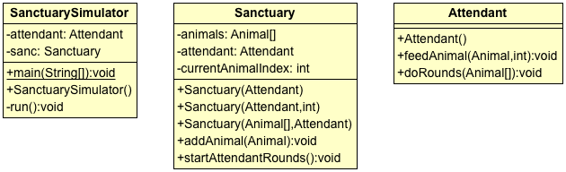

## Creating the Sanctuary

There are many **Animal** s at the **Sanctuary**.

There is an **Attendant** at the Sanctuary, whose whose job is to visit each animal and feed it a certain amount of food.

An Animal has
* a first Name

An Animal can
* eat a numeric amount of food
* make noise

There are different types of **Animal**.

A **Herbivore**, which does everything an Animal does.

A **Carnivore**, which can eat another Animal.

### Modeling the Application
The description above has several words bolded. They are all nouns.

When you are trying to figure out what classes your program needs, it is often useful to look at the nouns. The nouns often become classes.

#### Animals
You will create the classes `Animal`, `Herbivore`, and `Carnivore`. Then think of subclasses of each, and create them. An example UML diagram for the `Animal` hierarchy is shown below.


##### Functionality
* When an `Animal` eats, it makes its noise and displays the amount it ate. This is how we know Animals have eaten.
* When a `Carnivore` eats another Animal
  * it says its type and the type of the Animal it ate. (You could also include Animal names here).
    * To get the name of a class, call `getClass().getSimpleName()` on an object reference.
  * its `eat` method returns `null`.

#### Sanctuary
The `Sanctuary` is where Animals live. This means the Sanctuary _has-a_ collection of `Animal`s.

The `Sanctuary` also _has-a_ `Attendant`.

The `SanctuarySimulator` coordinates everything, and is executable by a user.

A UML diagram for the class structure is below.



##### Functionality
When the `Sanctuary` is created, it only has habitats for Animals (an initialized array).

The `SanctuarySimulator` adds `Animal`s to the `Sanctuary`, and creates the `Attendant` for the `Sanctuary`.

It then says when the `Sanctuary` should start the `Attendant` doing rounds.

When the `Attendant` does rounds, it will feed each Animal in the array.
  * If the `Animal` _is-a_ `Herbivore`, it should print a message saying it is feeding plants.
  * If the `Animal` _is-a_ `Carnivore`, it should print a message saying it is feeding meat.
  * The Attendant may feed each Animal a set amount, or this could be based on the type of Animal. For example, if the Animal _is-a_ `Elephant` or `Hippo`, it could get a larger amount of food.

The program is finished when the `Attendant` can do rounds and feed each Animal.

Sample output:

```
Dum de dum, love taking care of my Animal friends...
Attendant: I will feed this Animal 10 meats...
Lion: ROARRR!
	I ate 10 pounds.
Attendant: I will feed this Animal 10 plants...
Giraffe: I'm tall!
	I ate 10 pounds.
Attendant: I will feed this Animal 40 meats...
Hippo: I like violence!
	I'm hungry hungry, and I ate 40 pounds.
Attendant: I will feed this Animal 40 plants...
Elephant: My trunk has over 40_000 muscles in it.
	I ate 40 pounds.
	That's a lot of food!
```

### Project

Create a new Java Project, _AnimalSanctuary_.

Implement all of these classes so the Animal Sanctuary runs as described.

When you have this working, challenge yourself with the stretch goals:

* [Menu](menu.md)
* [Mayhem](mayhem.md)

<hr>

[Prev](README.md) -- [Up](README.md) -- [Next](menu.md)

