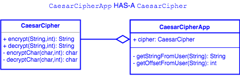

## Caesar Cipher

### Overview

In a Caesar’s Cipher, you shift each letter of the alphabet a set amount to encode a message.  For example with a shift of 3, the message “DOG” becomes “GRJ”, but with a shift of 7 "DOG" becomes "KVN".

You will write a program that will encrypt and decrypt text using Caesar's Cipher.

#### Structure

Starter code: `CaesarCipher/src/com.example.caesarcipher/CaesarCipher`

Starter code tests: `CaesarCipher/test/com.example.caesarcipher/CaesarCipherTests`

The `CaesarCipher` class has two method stubs, one that encrypts a message and another that decrypts the message.  Each method accepts a `String` and a numeric shift amount, and will return the encrypted or decrypted `String`.

`CaesarCipher` also has two private method stubs, for encrypting or decrypting a single character.  These are to be used by the public `encrypt` and `decrypt` methods.  You are welcome to factor your code into additional methods if you choose.

### Test-Driven Development
Almost all JUnit tests in `CaesarCipherTests` will fail at first.  Your task is to add code to the `encrypt` and `decrypt` methods, and to `encryptChar` and `decryptChar`, to get each test method to pass, one test method at a time.

Verify that all JUnit tests pass before writing a user-facing application that uses the `CaesarCipher` class.

*Hint: Remember characters are simply numbers behind the scenes*

### Caesar Cipher Application

Once you get the JUnit tests to pass, create an application class with a `main` that prompts the user for the message as well as the shift amount. It should use an instance of `CaesarCipher` to do the work.  Try to organize your application code into methods, rather than one massive `main`.  For example, a method that prompts for and returns the input message, another that prompts for and returns the shift amount.

#### Prerequisite

Implement the methods in the `CaesarCipher` class so that all JUnit tests in `CaesarCipherTests` pass.

#### User Story #1

The user is asked if they would like to encrypt or decrypt a message.

#### User Story #2

The user is now prompted to input the message in question.

#### User Story #3

The user is now asked by what shift amount they would like to encrypt or decrypt the message.

#### User Story #4

The message is then displayed in its encrypted or decrypted state depending on the selection in step 1.

* Can you decipher the message "Or fher gb qevax lbhe binygvar" with a shift of 13?

[Up](../README.md)
