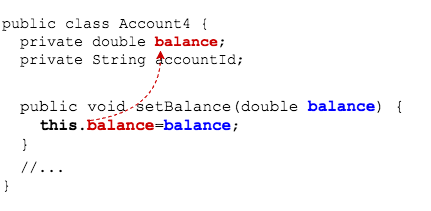

## The `this` Keyword

Every object has a reference to itself: `this`.

An object can use `this` to refer to its own fields and methods.

```java
public class Account3 {
  private double balance;
  private String accountId;

  public Account3(String aId) {
    accountId = aId;
    // this to call a method
    this.setBalance(0.0);
  }

  //...

  public void setBalance(double bal) {
    // this to access a field
    this.balance = bal;
  }
  //...
}
```

### `this` and Scope

Recall that scope is the `{ }` in which a variable lives.

What if we have a class designed like `Account4`?

```java
public class Account4 {
  private double balance;
  private String accountId;

  public void setBalance(double balance) {
    balance = balance;
  }
  //...
}
```

This setter does not set the `balance` _field_.

* Instead, it is setting the `balance` _parameter_ of the `setBalance` method.

* `balance = balance;` is redundant.

The reason for this is scope: because we have a parameter `balance` in the `setBalance` method, Java assumes that's what we're referring to when we write `balance = balance;`, not the `balance` field.

* We call this _shadowing_: inside `setBalance` the parameter name _shadows_ the field name.

> #### shadowing
> A local variable, with the same name as a field, having scope that overlaps the field's scope. When we use the name, the local variable is used. It's as if it casts a shadow over the field so that Java can't see the field anymore.


We can qualify which balance we mean by using `this`.

```java
public void setBalance(double balance) {
  this.balance = balance;
}
```
* This code sets the field `balance` to the value in the parameter `balance`.



### Drill
> `Encapsulation/com.example.encapsulation.drills.Account`
> * Change the class to use `this.` in the setter methods.
> * Rename your setter parameters the same as your fields.
> * Run `BankApp` to verify everything still works.

<hr>

[Prev](getters-setters.md) | [Up](README.md) | [Next](labs.md)

