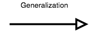
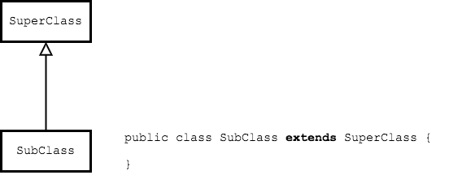

## UML and `extends`

In a UML class diagram, we use the "generalization" arrow to represent a class extending another class.



The generalization arrow has an open-ended triangle, and connects a child class to the parent class.



### Practice Exercise
> It may seem like the arrow should point the other way, from parent down to child.
>
> Here are a couple ways to remember which way the arrow goes:
> * The child class points to the parent it inherits from.
> * The child class is a _specialization_ of the parent class, which is more general. Therefore, the _generalization_ arrow points to the more _general_ class.


### `Employee extends Person`
The class diagram for our `Person` and `Employee` classes is below. Remember the visibility markers.

| Marker | Visibility|
| ------ | --------- |
| + | public |
| # | protected |
| ~ | package |
| - | private |

```java
public class Person {
  protected String firstName;
  protected String lastName;
  protected int age;

  public Person() {
  }

  public Person(String firstName, String lastName, int age) {
    this.firstName = firstName;
    this.lastName = lastName;
    this.age = age;
  }

  public String getName() {
    return firstName + " " + lastName;
  }

  public void setFirstName(String firstName) {
    this.firstName = firstName;
  }

  public void setLastName(String lastName) {
    this.lastName = lastName;
  }

  public int getAge() {
    return age;
  }

  public void setAge(int age) {
    this.age = age;
  }
}
```

```java
public class Employee extends Person {
  private String title;
  private double salary;
}
```


### "IS-A"
The generalization arrow is also called the _is-a_ arrow. We say `Employee` "is-a" `Person`.

Other examples:
* Dog _is-a_ Animal
* German Shepherd _is-a_ Dog
* F-15 _is-a_ Jet

Thinking in terms of _is-a_ can help us determine when to use inheritance.

If the following statements were **not** true, then `Employee` should **not** extend `Person`.
* An _Employee_ is a specialization _Person_.
* A _Person_ has a `lastName`, `firstName`, and `age`.
* An _Employee_ also has a `lastName`, `firstName`, and `age`.

### Drill
> (This drill does not require writing, only thinking.)
>
> Where did the class diagram's `+ Employee()` come from if it's not in the `Employee` class's source code?
>
> (Solution: _com.example.inheritance.solutions.Employee_)

<hr>

[Prev](final.md) -- [Up](README.md) -- [Next](fields.md)

