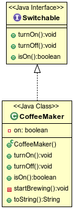

In general an _interface_ defines how we can interact with a system.

* _Java Standard Edition API_ (Application Programming Interface) defines the classes, and their visible fields and methods, that a Java developer can count on being able to use in any application running on the Java platform.

In Java an `interface` defines a set of abstract methods that a class promises to provide.

```java
interface Switchable {
  public void turnOn();
  public void turnOff();
  public boolean isOn();
}
```

The `implements` keyword declares that a class implements the methods declared in the interface.

```java
public class CoffeeMaker implements Switchable {
  private boolean on = false;
  public void turnOn() {
    this.on = true;
    this.startBrewing();
  }
  public void turnOff() {
    this.on = false;
    System.out.println("Coffee going cold");
  }
  public boolean isOn() {
    return on;
  }
  //...
}
```
* This _implementation class_ must implement all of the interface's abstract methods.

In UML, a dashed arrow indicates an interface implementation.

* The interface itself is marked with `<<interface>>`.



Users (other classes) declare variables and method parameters of the interface type when they need only the functionality defined by the interface.

```java
Switchable[] gear = new Switchable[2];
gear[0] = new CoffeeMaker();
gear[1] = new CoffeeMaker();

for (int i = 0; i < gear.length; i++) {
  gear[i].turnOn();
  System.out.println(gear[i] + " turned on.");
}
```

### Implementing Interfaces

An interface defines a _contract_ between the author of the implementing class, and code that uses the implementing class.

A class can implement any number of interfaces.

* Interface names are comma-separated after `implements`, which must come after `extends` (when present).

* Because a class can `extend` only one superclass, interfaces allow a class to declare additional facets of behavior.

```java
public interface Fillable {
  void fill(int amount);
}
```

```java
public class CoffeeMaker extends KitchenAppliance implements Switchable, Fillable {
  //... Switchable behavior ...

  // Fillable behavior
  private int percentFull;
  public void fill(int amount) {
    percentFull = amount;
  }
}
```

<hr>

[Prev](README.md) -- [Up](README.md) -- [Next](declaringInterfaces.md)

