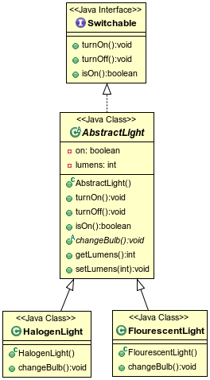
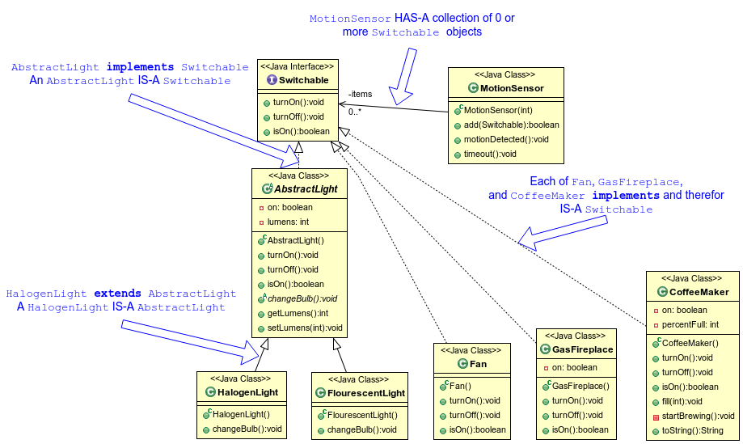
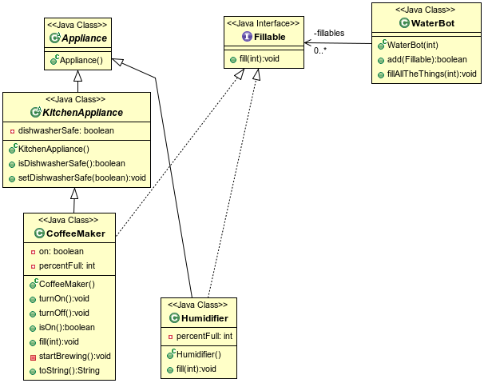

## Using Interfaces

Descendants of a class that implements an interface are also implementation classes of that interface.

```java
public abstract class AbstractLight implements Switchable {
  private boolean on;
  public void turnOn() {
    on = true;
    System.out.println(this.getClass().getSimpleName() + " turned on.");
  }
  public void turnOff() {
    on = false;
    System.out.println(this.getClass().getSimpleName() + " turned off.");
  }
  public boolean isOn() {
    return on;
  }
  //...
}
```
```java
public class HalogenLight extends AbstractLight { /*...*/ }
```
```java
public class FlourescentLight extends AbstractLight { /*...*/ }
```
* Because each extends `AbstractLight` (which implements `Switchable`), `HalogenLight` IS-A `Switchable` and `FlourescentLight` IS-A `Switchable`.



Users of an implementing class declare variables and method parameters of the interface type when concerned only with the behavior (methods) the interface defines.

```java
public class Fan implements Switchable { /*...*/ }
```
```java
public class GasFireplace implements Switchable { /*...*/ }
```
```java
public class CoffeeMaker extends KitchenAppliance implements Switchable, Fillable { /*...*/ }
```

A using class can interact with implementors of an interface without regard to their actual classes.

Below, `MotionSensor` can `add` anything that _IS-A_ `Switchable`.

```java
  //...
  FlourescentLight kitchenLight = new FlourescentLight();
  HalogenLight livingRoomLight = new HalogenLight();
  Fan ceilingFan = new Fan();
  GasFireplace fireplace = new GasFireplace();
  CoffeeMaker mrCoffee = new CoffeeMaker();

  MotionSensor sensor = smartHome.getMotionSensor();

  // add Switchables
  sensor.add(kitchenLight);
  sensor.add(livingRoomLight);
  sensor.add(ceilingFan);
  sensor.add(fireplace);
  sensor.add(mrCoffee);
  //...
```

```java
public class MotionSensor {

  private Switchable[] items;

  public MotionSensor(int numberOfItems) {
    items = new Switchable[numberOfItems];
  }

  public boolean add(Switchable item) {
    for (int i = 0; i < items.length; i++) {
      if (items[i] == null) {
        items[i] = item;
        return true;
      }
    }
    return false;
  }

  public void motionDetected() {
    System.out.println("MotionSensor: Motion detected.");
    for (Switchable item : items) {
      if (item != null)
        item.turnOn();
    }
  }

  public void timeout() {
    // Need to add code to determine if enough time has elapsed
    System.out.println("MotionSensor: Timeout occurred");
    for (Switchable item : items) {
      if (item != null)
        item.turnOff();
    }
  }

}
```




```java
public class Humidifier extends Appliance implements Fillable { /*...*/ }
```
```java
  //...
  Humidifier misty = new Humidifier();
  WaterBot fillerBot = smartHome.getFiller();

  // add Fillables
  fillerBot.add(mrCoffee);
  fillerBot.add(misty);
  //...
```

```java
public class WaterBot {
  private Fillable[] fillables;

  public WaterBot(int howMany) {
    fillables = new Fillable[howMany];
  }

  public boolean add(Fillable fillable) {
    for (int i = 0; i < fillables.length; i++) {
      if (fillables[i] == null) {
        fillables[i] = fillable;
        return true;
      }
    }
    return false;
  }

  public void fillAllTheThings(int percent) {
    for (Fillable fillable : fillables) {
      fillable.fill(100);
    }
  }

}
```



By implementing interfaces, we can allow an object to inherit multiple _types_.

* A `CoffeeMaker` object is of type `CoffeeMaker` of course, but it is also of type `Switchable` and type `Fillable` (as well as types `KitchenAppliance` and `Appliance`.)

<hr>

[Prev](declaringInterfaces.md) -- [Up](README.md) -- [Next](usingInterfaces-labs.md)

