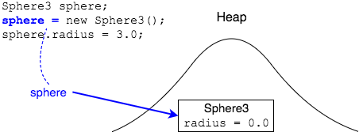

## Imagining the Heap

It is useful to draw the heap when thinking about objects and references.

In the example below, we will create a new `Sphere3` object and assign it to a reference variable.

```java
Sphere3 sphere;         
sphere = new Sphere3();
sphere.radius = 3.0;
```
First, we draw the heap and our variable, `sphere`.


Next, `new` creates an object on the heap. The object's field is assigned the default value of `0.0`.


In the same statement, the object's address is assigned to `sphere`. Represent this by drawing an arrow.



Finally, this code changes the field `radius`.


Note: we draw the heap's shape to remind us of its name, not because it has some type of shape in memory.

### Drill
> This drill requires pen and paper or whiteboard.
> ```java
> public class Item {
>   public double cost;
>   
>   // methods...
> }
>
> Item item1 = new Item();
> item1.cost = 3.57;
>  
> Item item2 = new Item();
> item2.cost = 5.00;
> ```
> * Two `Item` instances are created and changed. Draw them on the heap.
> * `Item item3 = item2;` Add this reference and assignment to your drawing.
>
> (Solution: _Objects/com.example.objs.solutions/heapImageSkillDrill.png_)

<hr>

[Prev](heap.md) -- [Up](README.md) -- [Next](public.md)

