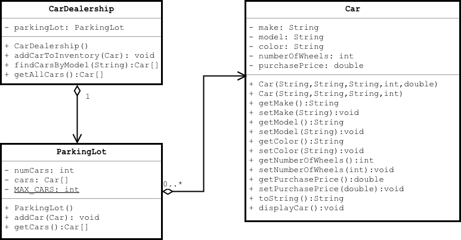

## Representing Objects with Diagrams

Software is hard to visualize, especially when classes and their relationships become complex.

Unified Modeling Language (UML) is a way of creating diagrams to represent classes and interactions among them.

We will focus on the _class diagram_, which shows how things in a system relate to each other.

### Practice Exercise
> UML is an extensive collection of diagram notations and modeling processes for Object-Oriented Analysis and Design (OOAD).  It's called "Unified" because it originally combined ideas from several early OOAD pioneers, notably Grady Booch, Ivar Jacobson, and James Rumbaugh.
> You don't need to know all of UML to write OO applications, but you should be able to recognize the basics of and use some of the key diagram notations.

[Prev](README.md) -- [Up](README.md) -- [Next](class-diagram.md)

