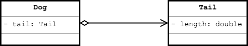
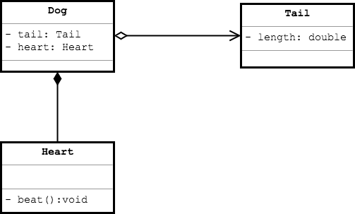
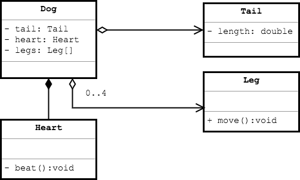

## Classes and Their Associations

It is often useful to draw several class diagrams, and show how they are associated.

We do this using arrows from one class diagram to another.

## Composition/Aggregation Arrows

One of the most useful arrows is the  _Composition/Aggregation_ or _"HAS-A"_ arrow.

#### _HAS-A_ Aggregation Arrow

When a class has a field whose type is another class, we can use an arrow with a diamond on one end.
* The relationship is called _aggregation_ because the class is made of other elements.
* The relationship is also known as _has-a_ because the class "has a" field for the other class.

In the partial class diagram below, `Dog` _has-a_ `Tail`.

The diamond belongs on the class that owns the other object.

### Practice Exercise
> The `>` on the owned side of the has-a relationship is optional. Either way makes sense.
>
> 

#### Aggregation and Composition

_Composition_ is a special type of aggregation which denotes a strong dependency between the owning class and the composite (owned) class.
* Without the composite class, the owning class does not function.

In the example below, the `Dog` has both a `Tail` and a `Heart`, and will not function without the `Heart`.

#### Multiplicity

Sometimes we show the _multiplicity_ of each class in a relationship by adding indicators to the has-a arrow.

> #### multiplicity
> The number of instances of one class linked to one instance of the other class.

For example, a `Dog` can have between `0` and `4` legs.

Options for multiplicity are listed below.

| Indicator | Meaning |
| - | - |
| 0..1 | Zero or one |
| 1 | Exactly one |
| 0..* | Zero or more |
| 1..* | One or more |
| * | One or more |
| n | Only n (where n > 1) |
| 0..n | Zero to n (where n > 1) |
| 1..n | One to n (where n > 1) |
| | Exactly one (default) |

[Prev](class-diagram.md) -- [Up](README.md) -- [Next](labs.md)

