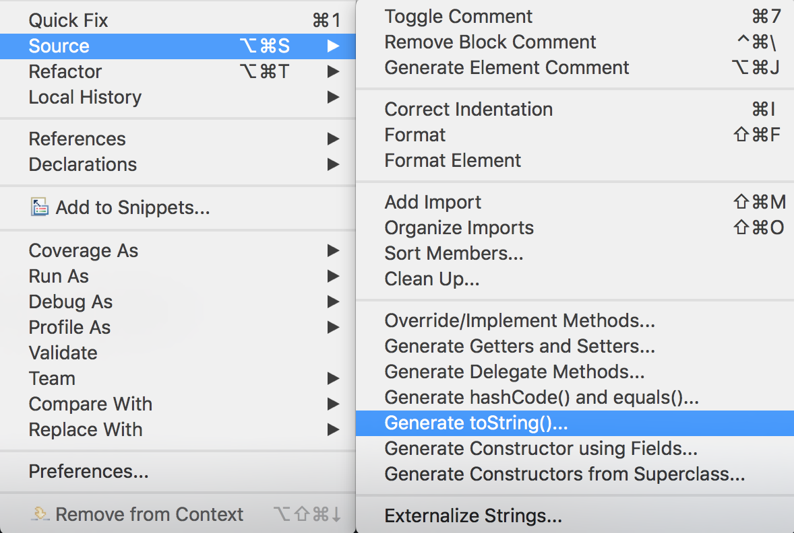
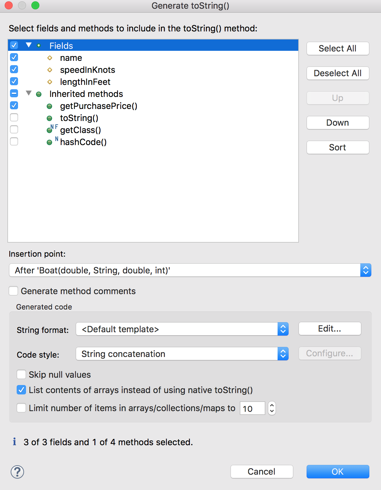
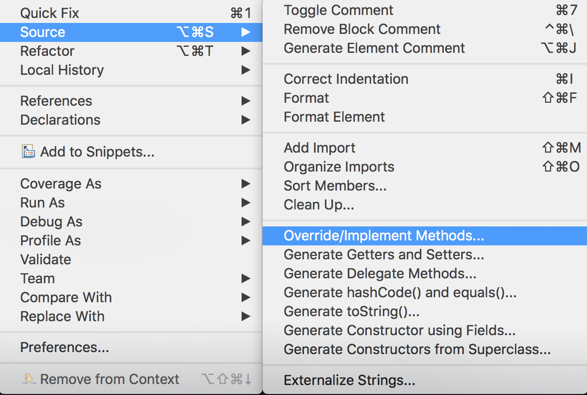
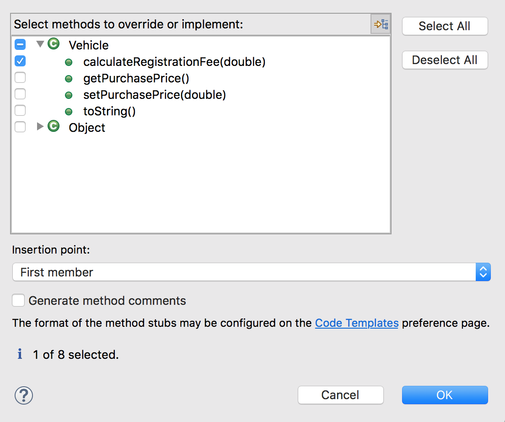

In this lab we will use polymorphism to customize class behavior, and create methods to use this functionality.

`Polymorphism/com.example.polymorphism.labs.vehicles`

1. `Vehicle` has a `toString()` method. Use Eclipse to add a `toString()` method to the subclasses `Boat`, `Automobile`, and `Truck`.
   * With a class open, choose _Source_ (right-click or **&#8984;&#8997;S**).
   * Choose _Generate toString()..._

     
   * Choose the fields to include in the `toString()` method, and any information from superclasses (via getters).

     

2. Add the method `public double calculateRegistrationFee(double rate)` to `Vehicle`.
   * Return `0.0`. This method is a stub.
3. Use Eclipse to override `calculateRegistrationFee` in `Boat`.
   * With a class open, choose _Source_ (right-click or **&#8984;&#8997;S**).
   * Choose _Override/Implement Methods..._

     
   * Choose the methods to override from superclasses.

     
   * Functionality: if a boat is `30` feet in length or more, double the `rate` and multiply by the purchasePrice. Otherwise multiply by the `rate` by the purchasePrice.
4. Override `calculateRegistrationFee` in `Automobile`.
   * Functionality: multiply the `rate` by the purchasePrice.
5. Override `calculateRegistrationFee` in `Truck`.
   * Functionality: if the numberOfWheels is `6` or more, multiply `rate` by `1.5` and multiply by the purchasePrice. Otherwise multiply the `rate` by the purchasePrice.

We will use JUnit tests to verify our `calculateRegistrationFee` methods work. Note that these classes belong in the `test` source directory.
1. `test/com.example.polymorphism.labs.vehicles.VehicleTests`
   * Uncomment the `assertEquals(double, double, double)` method call.
   * _Run As->JUnit Test_ to verify that `Vehicle` functions as expected.
2. `test/com.example.polymorphism.labs.vehicles.AutomobileTests`
   * Uncomment the test method and run the class. Fix any bugs in your `Automobile` code.
3. `test/com.example.polymorphism.labs.vehicles.BoatTests`
   * Uncomment the existing test method and run the class.
   * Add an appropriately named method to test if rate times two times the purchasePrice is returned for lengths greater than or equal to `30`.
4. Create new _JUnit Test Case_ `TruckTests`.
   * Add a method to test `calculateRegistrationFee` returns rate times purchasePrice for under six wheels.
   * Add a method to test `calculateRegistrationFee` returns rate times purchasePrice times `1.5` for six or more wheels.

The last task is to create a method to calculate the registration fee for any vehicle.
1. `com.example.polymorphism.labs.vehicles.VehicleApp`
   * Add a method `calculateVehicleRegistration` that has a `Vehicle` parameter and returns a `double`.
     * Functionality: calculate the `Vehicle`'s registration fee with the rate `0.05`.
   * Calculate the registration fee for each `Vehicle`, and print the purchase price and registration fee.

[Prev](override-rules.md) -- [Up](README.md)

