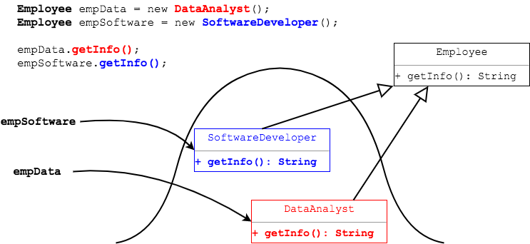

## Overriding Superclass Behavior

A subclass can define a method that overrides a method in the superclass.

* The subclass can define new behavior for this method.

The subclass method must have exactly the same signature as the superclass method.

```java
public class Person {
  // ...

  public String getInfo() {
    return firstName + " " + lastName + " " + age;
  }
}

public class Employee extends Person {
  // ...

  // OVERRIDE - exact same signature as superclass
  public String getInfo() {
    return super.getInfo() + " " + title + " " + salary;
  }
}
```

> #### method signature
> A method's name, and the number, order, and types of its parameters.
>
> Parameter names are not part of the signature.  The method return type is not part of the signature, though overriding imposes some rules on return types.

If we have a `Person` reference to an `Employee` object, `Employee`'s `getInfo()` method will be called.

```java
Person pers = new Employee(); // pers --> Employee object
pers.getInfo();               // Employee's getInfo()
```

If we have an `Employee` reference to a `DataAnalyst` or `SoftwareDeveloper` object, each class's `getInfo()` method is called.

```java

public class DataAnalyst extends Employee {
  // ...

  public String getInfo() {
    return super.getInfo() + " " + securityClearance;
  }
}

public class SoftwareDeveloper extends Employee {

  // ...

  public String getInfo() {
    return super.getInfo();
  }
}
```

```java
Employee empSoftware = new SoftwareDeveloper();
Employee empData = new DataAnalyst();

empSoftware.getInfo();  // calls SoftwareDeveloper method
empData.getInfo();      // calls DataAnalyst method
```




If the object does not have its own implementation of a method, its inherited method will be called.

The `DatabaseAdmin` class does not have its own `getInfo()` method, so `Employee`'s method is called.
```java
Employee empSoftware = new SoftwareDeveloper();
Employee empData = new DatabaseAdmin();

empSoftware.getInfo();  // calls SoftwareDeveloper method
empData.getInfo();      // calls Employee method
```


The process of method selection at runtime is known as _dynamic binding_.

> #### dynamic binding
> Determining _at runtime_ which method to call.
>
> Java bases the method to call on the type of object in memory instead of the type of the reference.

<br >

### Practice Exercise
Remember: the method that is chosen to run is based on the _object type in memory_, not the reference variable's type. This is a common interview and exam question, and is one of the key features of polymorphism.

_When there is an override..._

<code><b>M</b>ethod Choice = <b>M</b>EMORY</code>

<br >

### Drill
You will be adding a `public void executeJob(String data)` method to each class, and running an application to see each class's custom behavior.

`Polymorphism/com.example.polymorphism.drills.employee.Employee`
> * Add a method `public void executeJob(String data)` which prints the message `Executing job `_+ data_.
>   * Other classes will override this method.
>
`Polymorphism/com.example.polymorphism.drills.employee.DataAnalyst`
* Add a method `public void executeJob(String data)` which calls `analyzeData(String)` and passes the `data`.
  * Print the returned `String` to the screen.

`Polymorphism/com.example.polymorphism.drills.employee.DatabaseAdmin`
* Add a method `public void executeJob(String data)` which calls `createTables(String)` and passes the `data`.
  * Print the returned `String` to the screen.

`Polymorphism/com.example.polymorphism.drills.employee.SoftwareDeveloper`
* Add a method `public void executeJob(String data)` which calls `produceSoftware()`. (This does not do anything with `data`.)
  * Print the returned `String` to the screen.

`Polymorphism/com.example.polymorphism.drills.employee.ExecuteJobApp`
> * Uncomment the calls to `executeJob`.
> * Run the class to see `getInfo` and `executeJob` executed for each class.
>   * Remember that only `DataAnalyst` has an overriding `getInfo` method that changes behavior.
>   * `SoftwareDeveloper` has an overriding `getInfo` method, but it only calls its parent class's `getInfo` method.
> * Optional: refactor this class to reduce the copy-pasted code in `run()`.
> * Optional: place breakpoints in each class's `getInfo` and `executeJob` methods, and _Debug As_ to trace method execution.
>
> (Solution: _ExecuteJobApp.java_, _Employee2.java_, _DataAnalyst2.java_, _DatabaseAdmin2.java_, _SoftwareDeveloper2.java_)

<hr>

[Prev](polymorphism.md) -- [Up](README.md) -- [Next](override-annotation.md)

