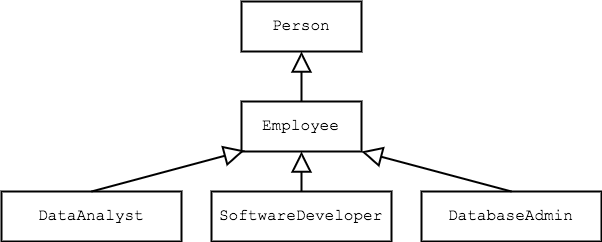
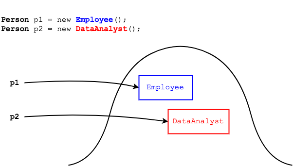

## Polymorphism in Java

_Polymorphism_ is a term from biology, in which an organism can take many forms or stages.

In Java, polymorphism allows us to use superclass references to subclass objects.

Recall the `Person` class hierarchy, to which we will add `SoftwareDeveloper` and `DatabaseAdmin` classes.



We can assign an `Employee` or `DataAnalyst` object to a `Person` reference.

```java
Person p1 = new Employee();
Person p2 = new DataAnalyst();
```

This creates two objects on the heap.



### Practice Exercise
Polymorphism is based on the "IS-A" relationship. We can assign _DataAnalyst_ objects to _Person_ references because _DataAnalyst_ IS-A _Person_ (via _Employee_).

### When Is a Superclass Reference Useful?
Superclass references to subclass objects are useful for _collections_ and _methods_.

#### Collections
If we have an array of superclass references, we can store subclass objects.
* This allows us to create an `Employee` array to store all employees in an organization, for example.

```java
Employee[] emps = new Employee[20];

emps[0] = new DataAnalyst();
emps[1] = new SoftwareDeveloper();

```

#### Methods
We know we can assign a `SoftwareDeveloper` or `DataAnalyst` object to an `Employee` reference, because each subclass _is-a_ `Employee`.

```java
Employee persEmp = new SoftwareDeveloper();
Employee persData = new DataAnalyst();
```

Imagine we wanted to print the name of anyone that _is-a_ `Employee`.
* Instead of a separate method for every subclass of `Employee`...

  ```java
  public void printEmpName(DataAnalyst a) {
    // ...
  }

  public void printEmpName(SoftwareDeveloper s) {
    // ...
  }

  public void printEmpName(DatabaseAdmin a) {
    // ...
  }
  ```

  ... we can have one method with an `Employee` reference parameter.

  ```java
  public void printEmpName(Employee e) {
    System.out.println(e.getName());
  }
  ```

  The method does not care if the reference points to an `Employee` object or subtype of `Employee`, just that the object _is-a_ `Employee`.

### Drill
`Polymorphism/com.example.polymorphism.drills.employee.EmployeePrintingApp`
> * `private void run()`
>   * Create an array of type `Employee` with space for 3 Employees
>   * Create a `DataAnalyst`, `SoftwareDeveloper`, and `DatabaseAdmin` using the multi-arg constructors for each, and add each object to the array.
>   * Call `processEmployees` and pass the `Employee` array reference.
> * Add a method `printEmployeeNameAndTitle` that takes an `Employee` reference and prints `name - title` to the screen.
> * `public void processEmployees(Employee[] employees)`
>   * Loop through the `Employee` array and call `printEmployeeNameAndTitle` for each `Employee`.

<hr>

[Prev](README.md) -- [Up](README.md) -- [Next](override.md)

