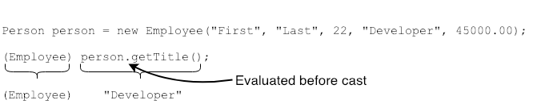
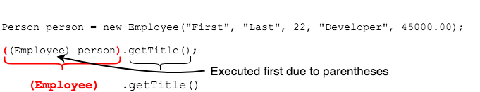

## Casting and Precedence

We can try to cast _and_ call a method in a single line, but we have to be careful.

This code will not compile due to the precedence of the dot `.` and cast `()` operators.

```java
Person person = new Employee("First", "Last", 22, "Developer", 45000.00);
String title = (Employee) person.getTitle();  // COMPILER ERROR
```
* `.` is evaluated before the cast to `Employee`, so the compiler tries to execute `getTitle()` on the `Person` reference.
  * `Person` does not have a `getTitle()` method; this is why we're trying to cast in the first place.




Even if we call a method that `Person` has, the cast still fails.

```java
String info = (Employee) person.getInfo();  // COMPILER ERROR
```
* The `(Employee)` cast would apply to the `String` returned from `getInfo()`, but this is illegal since `Employee` and `String` are not in the same hierarchy.


We solve this by using parentheses around the reference _and_ cast operation.

```java
Person person = new Employee("First", "Last", 22, "Developer", 45000.00);
String title = ((Employee) person).getTitle();
```



### Drill
> (If you did not finish `VehicleApp`, copy `...solutions.vehicles.VehicleApp2`)
>
> `Polymorphism/com.example.polymorphism.labs.vehicles.VehicleApp`
> * Change `run` to first print out the make and model if the vehicle _is-a_ `Automobile`, and the length in feet if the vehicle _is-a_ `Boat`.
>   * Then print the purchase price and registration fee.
>
> (Solution: _VehicleApp3.java_)

<hr>

[Prev](downcasting.md) -- [Up](README.md) -- [Next](instance-hiding.md)

