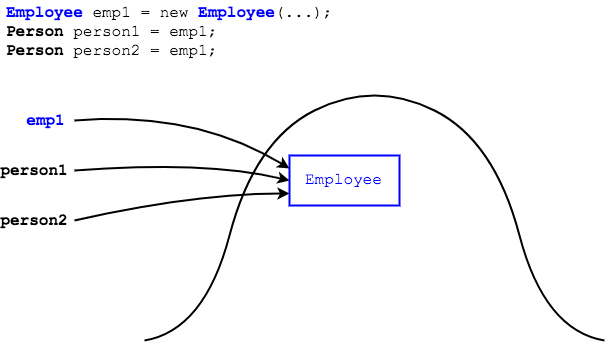

## Casting

We have seen that a variable can refer to an object of its own type, or of a subclass type.

```java
Person p = new Employee();
```
The `Employee` object returned by the `new` operator is implicitly cast to a `Person` before the assignment takes place.

This is the same as using the cast `()` operator directly.
```java
Person p = (Person) new Employee();
```

* This is known as _upcasting_ - the subclass object is cast _up_ the hierarchy to its superclass type.

> #### upcasting
> Casting up the inheritance tree, whether implicitly or using the cast `()` operator.

Upcasting works because any field or method that you try to access through the superclass variable is guaranteed to exist in the subclass (because it's inherited).

```java
Person p = new Employee();
System.out.println(p.getName());  // Employee has a getName() method inherited from Person
```

### Practice Exercise
> The object in memory is still the subclass, we're just treating it as a superclass.
>
> The `Employee` in memory was not transformed into a different class by casting it.

<br >

### Drill
> `Polymorphism/com.example.polymorphism.drills.employee.Upcasting`
>
> In this drill we will see how upcasting affects which methods the compiler allows us to call.
> * Follow directions in the `main` method to try and call methods using `Employee` and `Person` references.
> * The objects and references on the heap look like
>   

When we use a `Person` reference, we can only call `Person` methods - even though the object in memory is an `Employee`.
* The compiler knows the `person1` and `person2` references could point to any type of `Person` - an `Employee`, a `DataAnalyst`, or a `Person`.
  * Since the reference is a `Person`, `Person` methods are the only methods it can guarantee every subtype of `Person` will have.
  * Therefore, we can only call methods available to the type of the reference, `Person`.


### Practice Exercise
> The compiler only lets us upcast or downcast to classes in the same inheritance tree.
>
> We couldn't cast an `Employee` reference to a `String` reference, for example.
> ```java
> Person p = new Employee();
> String s = (String) p;  // COMPILER ERROR
> ```

<hr>

[Prev](README.md) | [Up](README.md) | [Next](downcasting.md)

