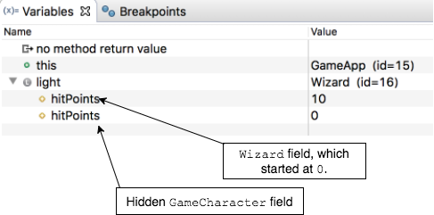
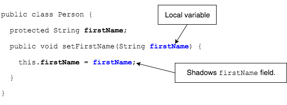

Declaring an instance field with the same name as a visible superclass field is called _hiding_.

* This means you have a field in a superclass that the subclass can see, and the subclass declares a field with the same name.

Consider this example, where the `Wizard` class hides the `GameCharacter`'s `hitPoints` field.

```java
public class GameCharacter {
  protected int hitPoints;

  public GameCharacter(int hp) {
    hitPoints = hp;
  }

  public void takeDamage(int damage) {
    hitPoints = hitPoints - damage;
  }

  public int getHitPoints() {
    return hitPoints;
  }
  // ...
}
```

```java
public class Wizard extends GameCharacter {

  protected int hitPoints; // hides GameCharacter hitPoints

  public Wizard(int hp) {
    super(hp);
  }
  // ...
  public void healSelfWithMagic(int amount) {
    hitPoints += amount; // accessing this class's field
  }
}
```

This leads to a bug in the program.
* The `Wizard` tries to heal, but is still eliminated.

```java
Wizard light = new Wizard(100);
// ...
light.takeDamage(50);        // hitPoints = 50

light.healSelfWithMagic(10); // attempt to heal

light.takeDamage(50);        // hitPoints = 0

if(light.getHitPoints() <= 0) {
  System.out.println("Against the power of Mordor, there can be no victory.");
}
```

The `Wizard` `light` has two `hitPoints` fields, which leads to an unexpected end.



Try it: `com.example.polymorphism.examples.game.GameApp`

### Field Shadowing
Field shadowing is where a local variable name _in a method_ has the same name as a field.
* Our setters usually have field shadowing.
  

### Shadowing vs. Hiding
* Shadowing happens in a _single class_.
* Hiding happens in a _class hierarchy_.

### Practice Exercise
> Shadowing is common, and can be handled with `this.`.
>
> Field hiding should not happen. Do not design your classes to hide fields.
>
> Resource: https://docs.oracle.com/javase/tutorial/java/IandI/hidevariables.html

<hr>

[Prev](casting-precedence.md) -- [Up](README.md) -- [Next](labs.md)

