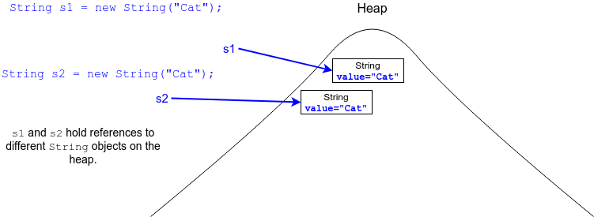
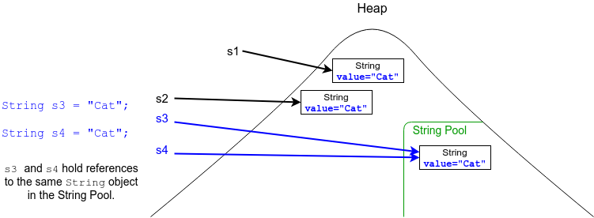
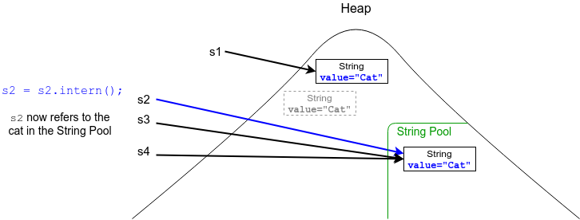
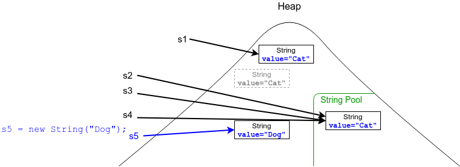
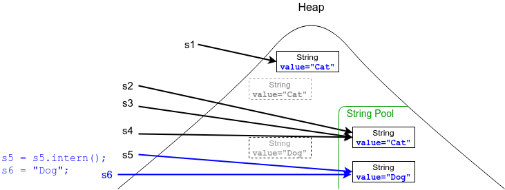

## The String Pool

When we call a `String` constructor with `new`, a new `String` object will always be created at runtime.

```java
String s1 = new String("Cat"); // A cat
String s2 = new String("Cat"); // Another cat
System.out.println(s1 == s2);  // false: two different references.
```



When we use string literals in our code, Java creates `String` objects for them in a special area of the heap: the _String Pool_.

* Every part of your application shares the strings in the String Pool.

* Only one copy of each string literal is kept in the String Pool.

  ```java
  String s3 = "Cat";
  String s4 = "Cat";
  System.out.println(s3 == s4);  // true: both references to the
                                 //       same object in the String Pool.    
  ```


* Because each `String` is immutable, and the values of all your string literals are known at compile time, Java is able to use the String Pool to save memory.

The term for this is _interning_.

* As each `String` literal is encountered, Java first checks the String Pool to see if a `String` object with the same value already exists.

  * If so, Java just uses a reference to the existing object.

  * If not, Java creates the new `String` in the String Pool.

The Java compiler is smart enough to intern two concatenated string literals.

* A string concatenation that includes a variable will not be interned, however.

  ```java
  String chip = "Potato" + "Chip"; // "PotatoChip" will be interned in the String Pool.
  String fry = "Fry";
  String french = "French" + fry;  // "FrenchFry" will NOT be interned.
  ```

### `String.intern()`

The `intern` method attempts to place a `String` into the String Pool at runtime.

* If a string with the same value was already in the String Pool, `intern` returns its reference.

  ```java
  System.out.println(s2 == s3);  // false: different references.
  s2 = s2.intern();
  System.out.println(s2 == s3);  // true: s2 now refers to the cat that was in the String Pool.
  ```
  

* If it succeeds, it returns the new reference to the interned `String`.

  ```java
  String s5 = new String("Dog"); // New object on the heap.
  ```
  

  ```java
  s5 = s5.intern();              // Move dog to the String Pool.
  String s6 = "Dog";             // dog is already in the String Pool.
  System.out.println(s5 == s6);  // true
  ```
  


### Drill
`StringAndStringBuilder/com.example.stringstringbuilder.drills.StringPoolTesting`
>
> * Read each of the commented `System.out.println` statements and write down whether it will print `true` or `false`.
> * Uncomment each one and run it, making sure you understand the result.

<hr>

[Prev](String.md) -- [Up](README.md) -- [Next](StringMethods.md)

