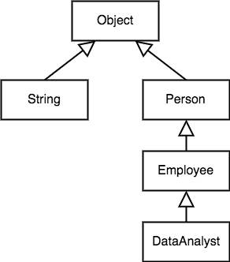
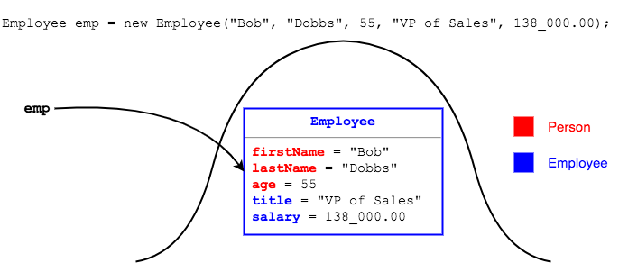

## The `Object` Class
Ultimately, every class in Java descends from `java.lang.Object`.



This means all classes inherit several `Object` methods.
* `public boolean equals(Object obj)` - value comparison.
* `public String toString()` — return a `String` representing details about this object.
* `public final Class getClass()` — retrieve a `Class` object.
* `public int hashCode()` — retrieve a numeric identifier for this object.

### Every Class IS-A `Object`
If we don't declare that a class extends another class, it implicitly extends `Object`.
```java
public class Person {
  // ...
  public Person() {

  }
  // ...
}
```
The `Person` class has no `extends` directive, so it extends `Object`.
* Its constructor's implicit call to `super()` is `Object`'s no-arg constructor.

Therefore, `Employee` and `DataAnalyst` also have `Object` in their hierarchy, and inherit `Object` methods.

### Class Hierarchies and Memory
When instantiating a subclass, only one object is built in memory.
* The new object contains memory allocations for all of the fields in the subclass, as well as those in the superclass.
* You will not have a separate object created for the subclass and the superclass.



<hr>

[Prev](super-rules.md) -- [Up](README.md) -- [Next](labs.md)

