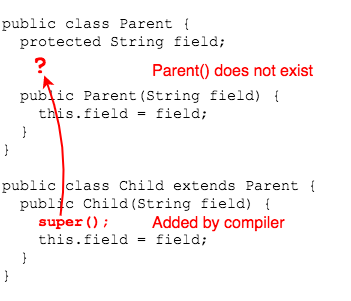
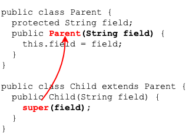

## Rules for `super()`

### `super(...)` is Always Called
When we don't write a call to `super()`, the compiler will try to add one.
  * The members of the superclass must be initialized before the subclass, and Java uses the constructor to do so.

The class...
```java
public DataAnalyst(String securityClearance) {
  this.securityClearance = securityClearance;
}
```
is compiled to become...
```java
public DataAnalyst(String securityClearance) {
  super();   // Added by the compiler
  this.securityClearance = securityClearance;
}
```

Whether we have written it or not, every constructor will have a call to `super(...)` or `this(...)`.
* Either we put a call to `super(...)` or `this(...)` in our constructors, or the compiler adds `super()`.


### `super` May Be Required
Two points about constructors are very important to remember:
* When we code a constructor, the compiler no longer adds the no-arg default constructor.
* If we don't see a call to `super(...)` in a constructor, Java tries to add a call to the no-arg `super()`.

Consider this class hierarchy, which will result in a compiler error.

```java
public class Parent {
  protected String field;

  public Parent(String field) {
    this.field = field;
  }
}
```

`Child` initializes the `protected` field, but will not compile.
```java
public class Child extends Parent {
  public Child(String field) {
    this.field = field;
  }
}
```

The problem is that Java has tried to compile the `Child` constructor to call a no-arg constructor in `Parent`, which does not exist.



For `Child` to compile, we have to add the call to `super(field)` ourselves (assuming we cannot add a no-arg constructor to `Parent`).

```java
public class Child extends Parent {
  public Child(String field) {
    super(field);
  }
}
```



### `super()` Must Be First
`super()` can only be called from a constructor, and must be the first statement, also like `this()`.

```java
public Employee(String firstName, String lastName, int age,
    String title, double salary) {
  this.title = title;
  this.salary = salary;
  super(firstName, lastName, age);  // COMPILER ERROR
}
```

<br >

### Practice Exercise
You can never have `this()` and `super()` in the same constructor.

Both `this()` and `super()` must each be the first line in a constructor.

If you have both, one is not first, so you can't have both.

Resource: https://docs.oracle.com/javase/tutorial/java/IandI/super.html

<hr>

[Prev](super-ctor.md) | [Up](README.md) | [Next](object.md)

