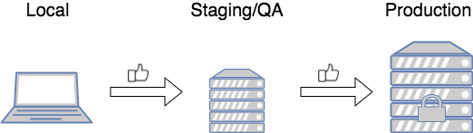
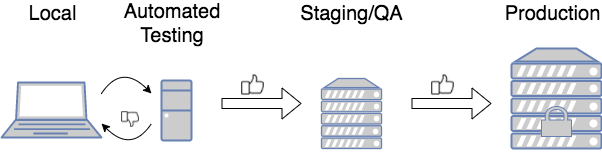
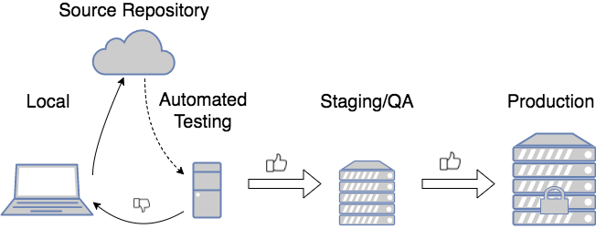

## Building and Deploying Software

The cycle of building and deploying software is usually split into several stages.

A stage is where the code is built or deployed, and run.

Code is _promoted_ from one stage to the next, the last stage being _Production_, where end users can use it.

> #### Production
> The place where "final" code is deployed so a client can use it.

### Software Development Environments

We will discuss each stage in the building and deploying process.

#### Local Environment

This is your computer, where you write and test your code.

#### Staging / QA

A different environment, where your code is part of a larger system.

Here it is tested by _Quality Assurance_ (QA) professionals.

The QA tester's job is to
* Verify that your code meets requirements, and cannot be broken.
* Think like users, and use the system in counterintuitive ways.

When they find problems, testers report these issues in some type of bug tracking software, and you then fix your code.

Once the code is verified in QA, it can go to Production.

(Note: sometimes Staging and QA are separate environments.)

#### Production

This is the most important environment because end users interact with the software here.

Any bugs found here are costly in terms of:
* _Money_ - spending time to fix things that should already work is time not spent elsewhere.
* _Brand image_ - users see your product, and a broken product can lead to a poor perception among your consumers.

It is important to catch bugs before they get to production.

### Automated Testing and Deployment

_Automated testing_ uses other programs to test our code.

These programs run a series of tests to see if the code works.

Automated testing is different than manual testing, which requires time and effort.
* By using an automated testing program, bugs can be caught and fixed before more person hours are spent on them.
* Automated testing can improve quality and save time (which saves money).

Often, systems are set up so that any code pushed to a code repository is automatically deployed to an environment where these automated testing programs are run.

We will implement automated testing by writing tests for our classes, which determine whether our code works, using a tool called _JUnit_.

[Prev](testing.md) -- [Up](README.md) -- [Next](junit.md)

