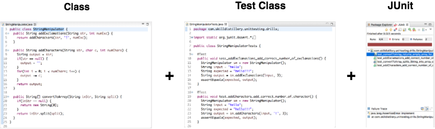
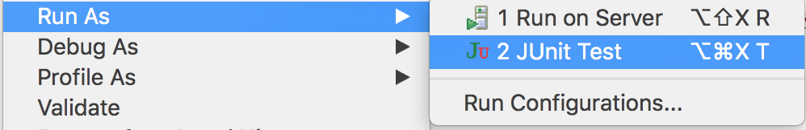

## JUnit

_JUnit_ is a lightweight framework for automating unit testing in Java.

> #### unit testing
> Verify that a particular piece of code works properly in isolation.

To test a piece of code, we write a _test class_, or _test case_, in Java.

* Purpose: run methods of our code.
* Strategy: use outputs of our code's methods and check if those outputs are the values we expect.

JUnit is included in Eclipse, so we can run our test class and see if our methods worked.

### Drill
`UnitTesting/test/com.example.unittesting.drills.StringManipulatorTests`
* In _Package Explorer,_ right-click the `StringManipulatorTests` class and choose _Run As->JUnit Test_. (Note that the package is in the `test` source directory.)

 

* See what happens.

[Prev](build-deploy.md) -- [Up](README.md) -- [Next](test-class.md)

