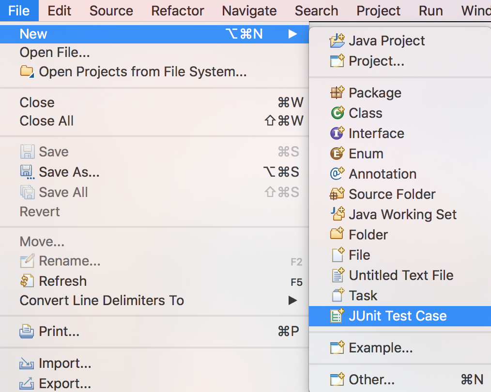
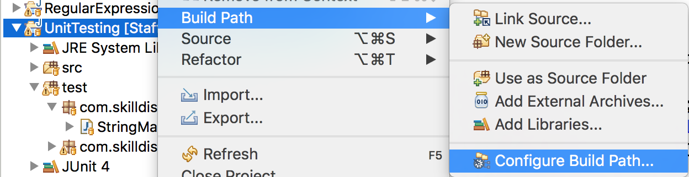
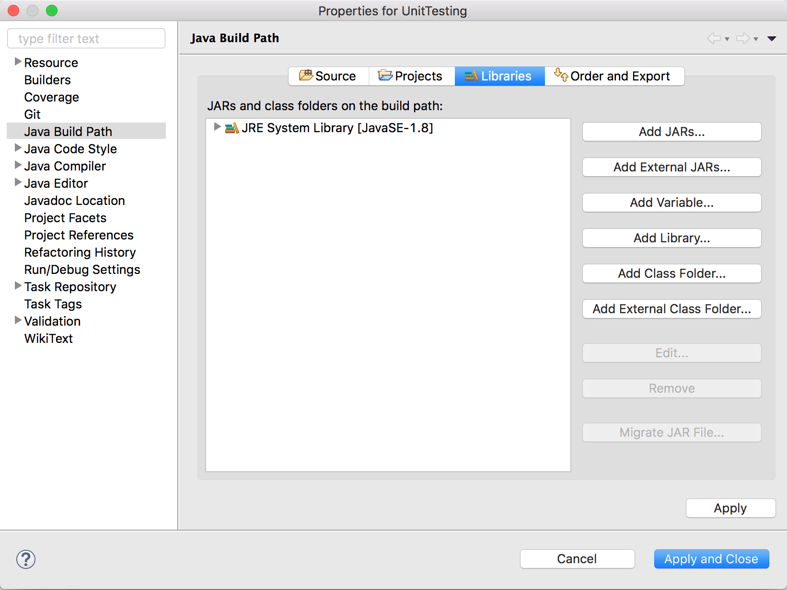
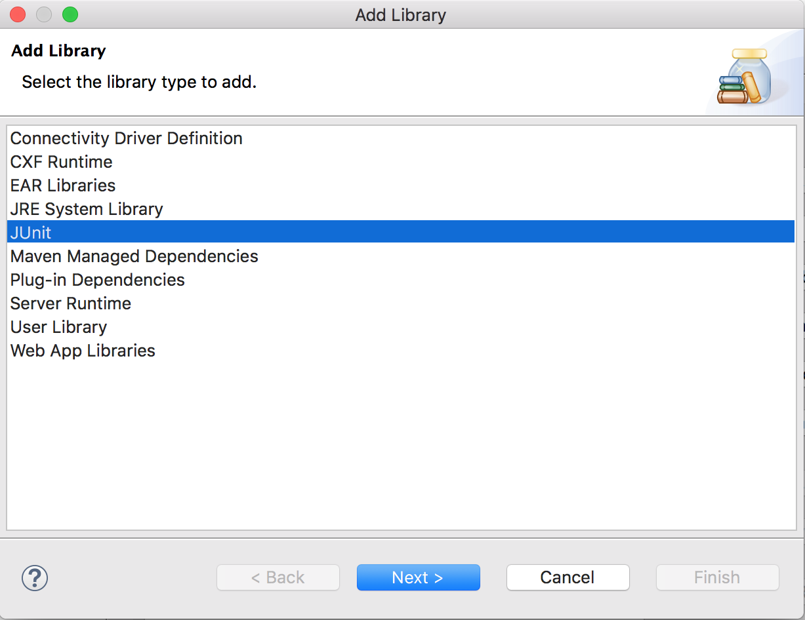

## Test Classes

The role of a test class is to test the public (and sometimes protected) methods of a single class.

Eclipse's JUnit integration runs each method in the test class, and then reports whether the test method passed or failed.

The test class has no `main` method - JUnit runs methods inside the class.

### `test` Source Directory

Test classes belong in a separate source directory.

Instead of `src`, these classes go in `test`.

This separation allows an automated build tool to exclude the `test` directory when it packages your code for promotion.

### Creating a Test Case

Create a new JUnit test class by selecting _File->New->JUnit Test Case_.



This creates the Java class, but also allows you to add JUnit code to Eclipse's _Build Path_.

### Build Path

Eclipse's _Build Path_ is where it looks for configuration, like code to include and source folders.

If you forget to add JUnit to the build path, run these steps.

1. Right-click the project and select _BuildPath->Configure Build Path_.

   

2. On the _Libraries_ tab, choose _Add Library_.

   

3. Select _JUnit_, and choose _JUnit 4_.

   

### Test Class Naming

Name the test class to match the class it's testing, plus `Tests`.

```java
public class StringManipulator {
 // ...
}
```

```java
public class StringManipulatorTests {
 // ...
}
```

### Package

The test class should share the same package as the class it tests.
* This allows access to package-only methods, and makes the class easy to find.
* The class is still in the `test` source directory.

### Practice Exercise
Unit tests are especially useful when it comes time to _retest_ our code. We must always retest when we make a change, and pressing a button to verify functionality is a lot easier than manually testing again.

<br >

### Drill
`UnitTesting/test/`

`UnitTesting/src/com.example.unittesting.drills.TextConverter`
* Create a new JUnit test case for `TextConverter`. Be sure to create the correct package in the `test` source folder first.

<hr>

[Prev](junit.md) | [Up](README.md) | [Next](test-methods.md)

