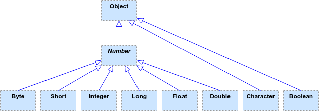

For each of the eight primitive data types, the Java API provides a _wrapper class_ whose objects encapsulate values of that type.

```java
int i = 47;                     // int primitive
Integer iObj = new Integer(47); // Wrapper object for an int primitive
```

|Primitive Type|Wrapper Class|
|--------------|-------------|
| `byte`       | `Byte`      |
| `short`      | `Short`     |
| `int`        | `Integer`   |
| `long`       | `Long`      |
| `char`       | `Character` |
| `float`      | `Float`     |
| `double`     | `Double`    |
| `boolean`    | `Boolean`   |


Why?

* Many data structures rely on references to objects - but you can't have a reference to a primitive.

* The wrapper classes provide useful operations and information related to their primitive type.

These classes are in the `java.lang` package, so no need to import anything to use them.

* All the wrappers except `Character` and `Boolean` extend the abstract class `Number`; `Character` and `Boolean` extend `Object`.



* All of the wrappers are declared as `final` classes - you can't extend a wrapper class.

  * You could subclass `Number`.


<hr>

[Prev](README.md) -- [Up](README.md) -- [Next](wrapperMethods.md)

