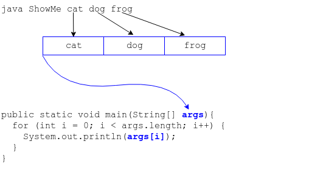

## The `args` Array

Every program you run, Java or not, can be given a list of words on its command line.

```bash
ls                            # No words on the command line
ls drills                     # One word on the command line
ls drills solutions           # Two words on the command line
ls drills solutions whatever  # Three words on the command line
```
* It's up to each program to interpret what those words mean - filenames? options? something else?

Each word on the command line (also known as _command-line parameters_ or _arguments_) is separated from the others by one or more spaces.

The _shell_ - the program running in the terminal which receives and executes your commands - puts all words on the command line into an array which gets passed to the program you're running.

> #### shell
> A computer program that allows a user to interact with the system, primarily by executing other programs at the user's command.  When you work in a terminal or console, the shell is your _command-line interface_ (_CLI_) with the operating system.

* The `java` command places the words it receives (other than its own name `java` and the name of the main class it's running) into a Java `String` array which it passes to our `main` method.



* We could actually name `main`'s string array parameter something other than `args`.

  ```java
  public static void main(String[] stuffFromTheCommandLine) { ... }
  ```

  * But then all the other Java programmers will point and laugh at us.

### Drill
In `main` add:
```java
System.out.println(args.length);
```
Save `ShowMe.java`, return to the terminal, and run it both with and without arguments.
```bash
java drills.ShowMe
java drills.ShowMe cat dog frog
```

Treat `args` just like any other array.

* Check its `length` field.

* Iterate over it with a `for` loop.

* Pass it to another method.

### Drill
In `main`, add a for loop below the existing code.
* Open a new line.
* Type `for` and hit `Ctrl-Space`.
* Select `for - iterate over an array` from the list and hit `Enter`.
Eclipse creates a for loop for the nearest array it sees, which happens to be `args`.
* In the `for` loop body add:
  ```java
  System.out.println(i + ": " + args[i]);
  ```
* Save `ShowMe.java`, return to the terminal, and run it both with and without arguments.
  ```bash
  java drills.ShowMe
  java drills.ShowMe cat dog frog
  ```

<hr>

[Prev](mainMethod.md) -- [Up](README.md) -- [Next](handlingArguments.md)

