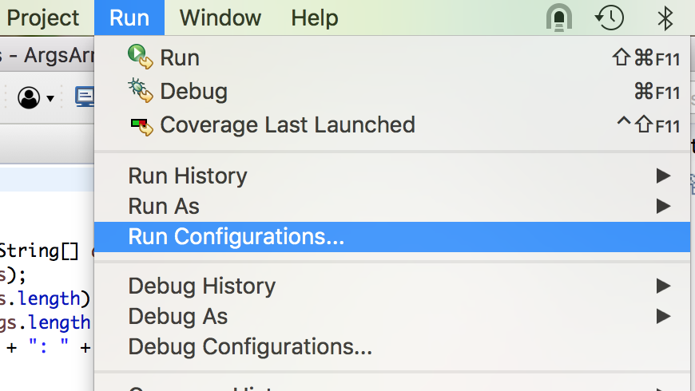
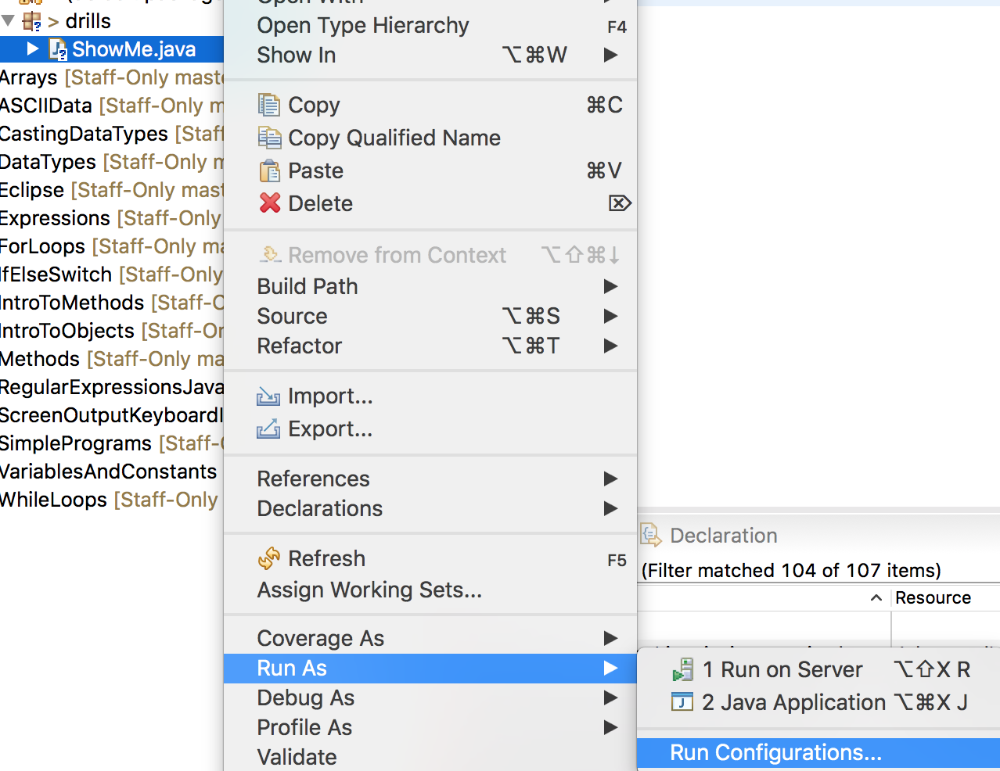
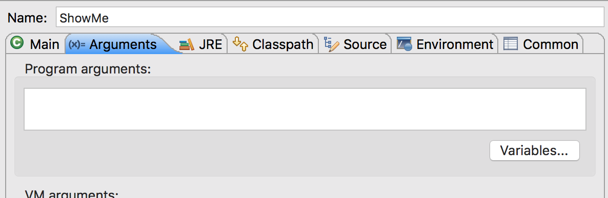
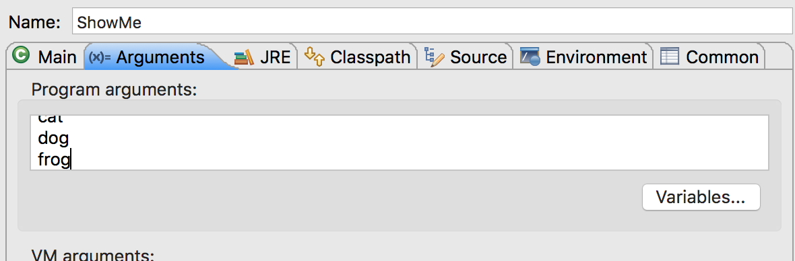

## Testing `args` In Eclipse

When you run a Java Application in Eclipse, Eclipse constructs and executes the `java` command line behind the scenes.

You can pass command line arguments without switching to a terminal from Eclipse.

* With your class selected go to the _Run Configurations_ dialog either from the _Run_ menu at the top of Eclipse, or by right-clicking on your class and going to the _Run As..._ submenu.

* In the _Run Configurations_ dialog go to the _Arguments_ tab.

* Add your arguments to the _Program arguments_ text box one per line, or separated by at least one space character.

* Click **Run**

[Prev](handlingArguments.md) -- [Up](README.md) -- [Next](labs.md)

