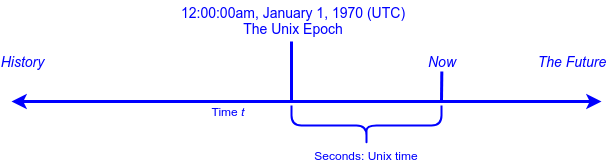

## Temporal Data

Numbers and text are relatively easy to store and manipulate in a program.

Values representing dates, times, and time periods are a little trickier to work with.

* The result of addition and subtraction of time periods is subject to the calendar system being used.

* Systems of time are subject to arbitrary adjustments - leap years, leap seconds, etc.

* _Temporal_ (time-related) data must be represented numerically in memory, but be comprehensible and usable for humans.

  * This includes the many different national and cultural conventions for date formats, day and month names, etc. needed for parsing dates and times from text, or outputting dates readably.

### Practice Exercise
> See: https://www.usno.navy.mil/USNO/time/master-clock/systems-of-time for a summary of various systems of time.

### Unix Epoch

When the Unix operating system (ancestor of Linux and MacOS) was created, its designers chose to represent time as quantities relative to an arbitrary instant in history.

* Since this development was happening in 1969, they chose midnight January 1, 1970 Universal Coordinated Time, as the _Unix epoch_ - the origin point from which their operating system would keep track of time.

  

To store time they designated a signed integer representing seconds relative to the epoch.

* Pre-1970 dates are negative numbers.

All dates and times on Unix-based systems are represented and calculated from these numbers.

### `java.util.Date` and `java.util.Calendar`

Java 1.0 provided the class `java.util.Date`, an object which encapsulates a Unix-time instant, but with millisecond precision.

`java.util.Date` defines methods and constructors for interpreting the epoch seconds as a date, with year, month, day, hour, minute, and second.

* Because these somewhat naively assume a US calendar, they have been deprecated since Java 1.1.

To interpret an epoch instant as a calendar date and time, Java 1.1 added `java.util.Calendar`, an abstract class that can be subclassed for various international calendar systems including the Gregorian system used in the west.

`java.util.Calendar` provides constants and methods for retrieving date and time information from a Unix time instant.

```java
Calendar cal = GregorianCalendar.getInstance(); // Current instant
int dow = cal.get(Calendar.DAY_OF_WEEK);
String day = cal.getDisplayName(Calendar.DAY_OF_WEEK, Calendar.LONG_FORMAT, Locale.getDefault());
System.out.println("Today is " + day);
// "Today is Tuesday"
```

### Joda Time

Java developers who found `Date` and `Calendar` difficult to work with and lacking in features have developed their own temporal-data class libraries.

One of these, the _Joda Time_<sup>1</sup> library, started in 2003 and evolved into a de-facto standard allowing Java developers to bypass `java.util.Date` and `java.util.Calendar` entirely.

### Practice Exercise
> Why all the hate for `java.util.Date`?  Among other idiosyncracies:
> * Months are given as numbers from `0` to `11` while days of months run from `1` to `31`.
> * Years are given as a number with `1900` subtracted - that is, `2018` would be given as `118`.
> * `Date` objects are mutable, so are not thread-safe.
> * It's not really a date at all, but a Unix-time instant.
>
> Other criticisms can be made, but there are enough that developers have chosen to invent new implementations rather than use it.

### The Java 8 Date and Time API

With the cooperation and leadership of its author, nearly all of the Joda Time API was incorporated into the Java Platform SE 8 under the `java.time` package.

* The new Date and Time API was a major and long-awaited feature of Java 8.

Key classes include:

* `LocalDate`
* `LocalTime`
* `LocalDateTime`
* `ZonedDateTime`
* `Duration`
* `Period`
* `DateTimeFormatter`

These classes do not have public constructors - you instantiate them with `static` _factory methods_ of their class.

* Objects representing values are immutable, just like `String` and the wrapper classes.

Values follow the ISO-8601 standard for representation of dates and times.


[1] http://www.joda.org/joda-time/

<hr>

[Prev](README.md) | [Up](README.md) | [Next](LocalDate.md)

