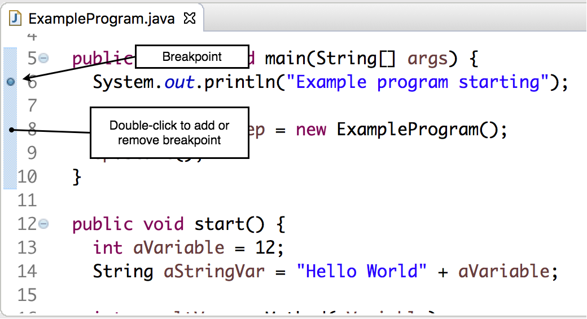
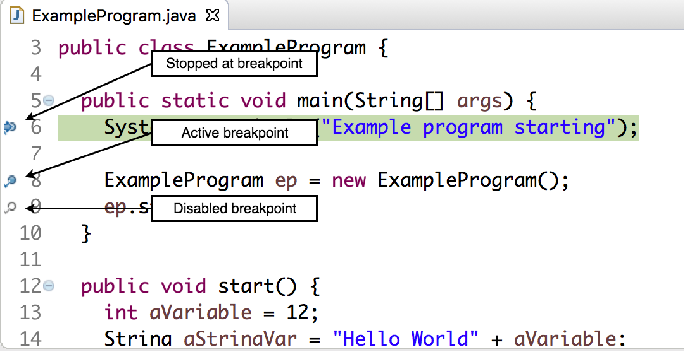

The debugger must reach a line with a breakpoint in order to pause the program (or even switch to the _Debug_ perspective).

### Adding and Removing Breakpoints

To add or remove a breakpoint, double-click in the gutter next to the class's line numbers.
* You can do this on statements only, not comments or empty lines.

### Running the Program

Select _Debug As->Java Application_ to start the program.

When the program stops at a breakpoint, the line is highlighted.

The style of the breakpoint tells you what the debugger will do upon reaching it.

A disabled breakpoint will not pause the program.

[Prev](debug-perspective.md) -- [Up](README.md) -- [Next](variables.md)

