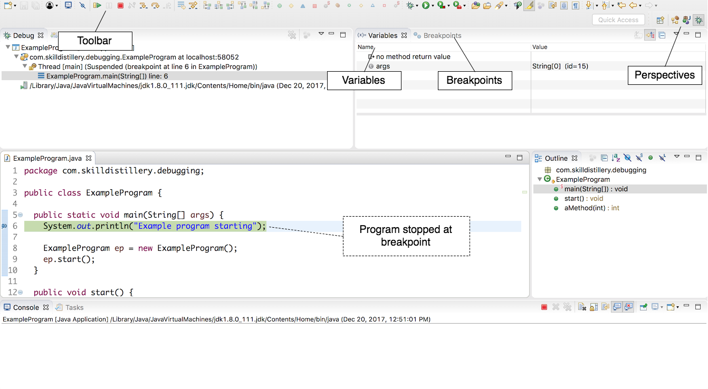
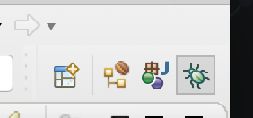
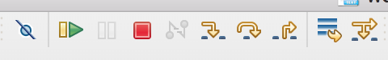
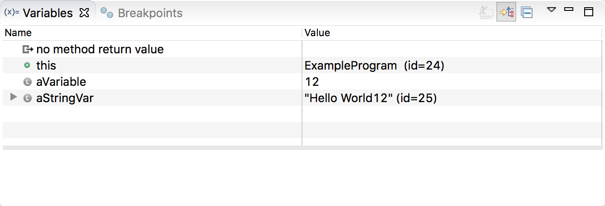
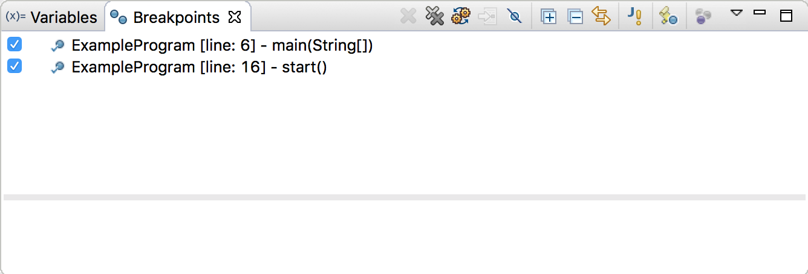

## The Debug Perspective

The _Debug_ perspective contains tools for interacting with your paused program.

### Perspectives

The top-right of the screen lists open perspectives.

The perspective with the insect icon is the _Debug_ perspective.

To switch perspectives - such as going back to the _Java_ perspective - click the **J** icon.

### Toolbar

The toolbar has buttons for advancing the program or stopping it entirely.

### Variables

The _Variables_ tab shows variables that are in scope, with their values.

Seeing variables as they change is one of the keys to debugging.

### Breakpoints

For the program to stop, you have to add a breakpoint.

The _Breakpoints_ tab shows all breakpoints in all programs, and allows you to delete and disable breakpoints.

Unchecking a breakpoint will disable it, so the debugger does not stop on that line, but will not remove the breakpoint.

[Prev](eclipse-debugger.md) -- [Up](README.md) -- [Next](breakpoints.md)

