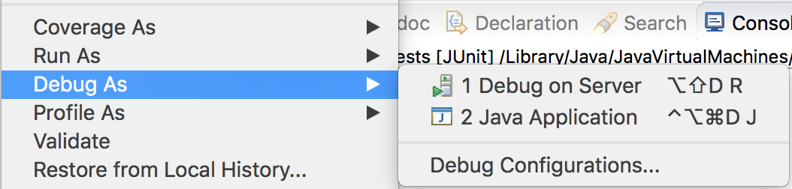
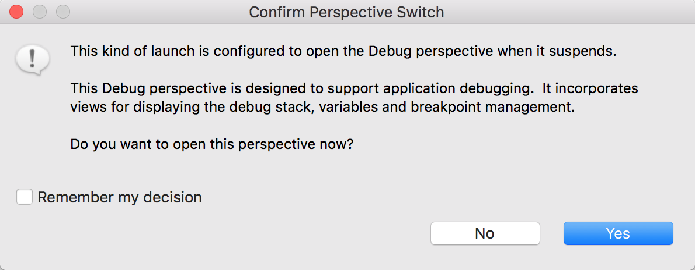
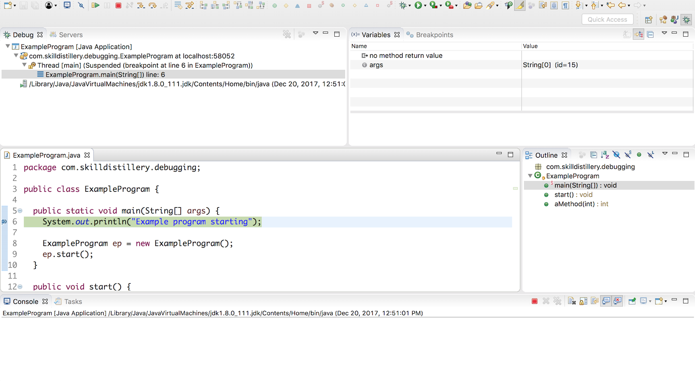

Debugging a program in Eclipse is almost the same as running a program.

* Run: _Run As->Java Application_
* Debug: _Debug As->Java Application_

When the program hits a breakpoint, it asks to open the _Debug perspective_.

Select _Remember my decision_ and choose _Yes_.

This takes you to a set of views for debugging.

### Practice Exercise
> If you try to _Debug As->Java Application_, but the program did not pause, it probably did not reach a line with a breakpoint.

[Prev](debugger.md) -- [Up](README.md) -- [Next](debug-perspective.md)

