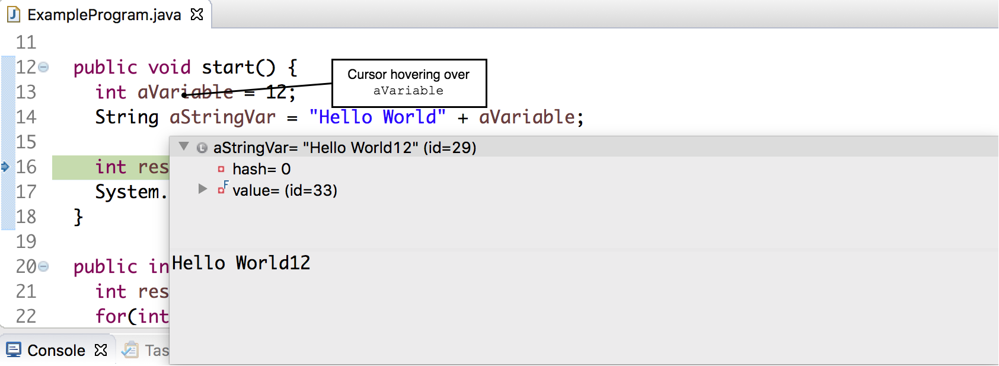
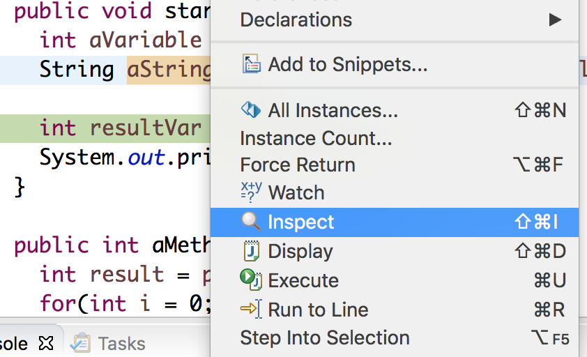
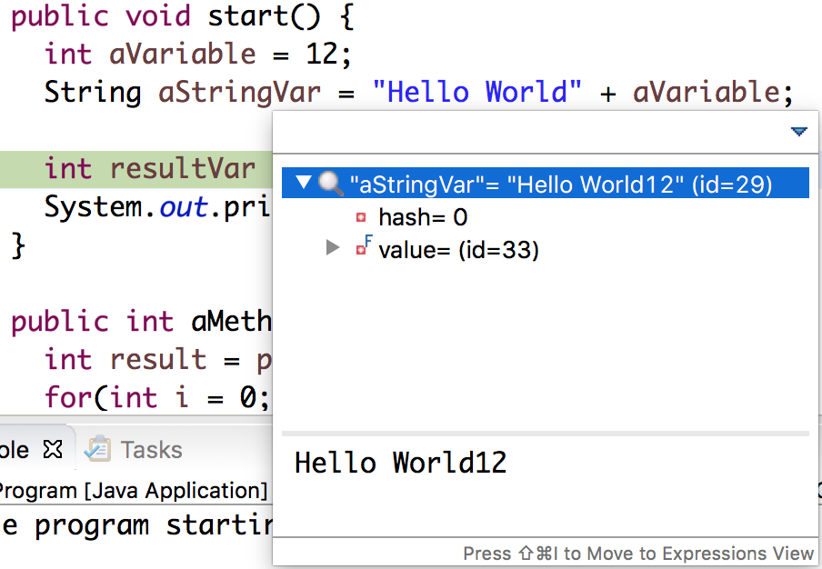
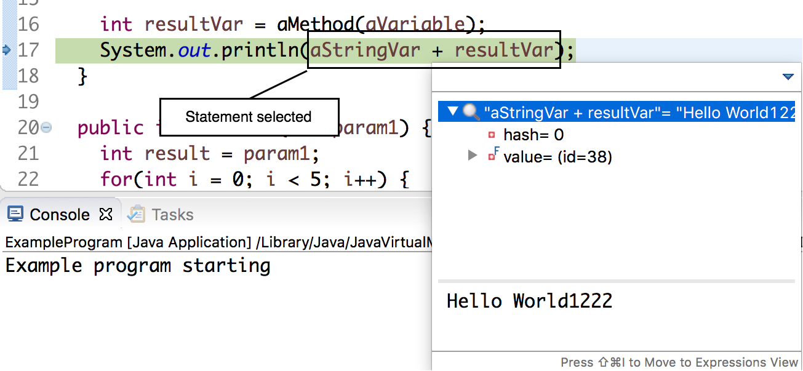

## Examining Variables

There are several ways to examine the contents of variables.

### Variables Tab

The variables tab shows all variables in scope.

### Hover

We can hover over a variable when the program is paused to see its value.

### Inspect

Right-click a variable when the program is paused and choose _Inspect_ to see its value.

### Inspect Statements

Highlight a statement and choose _Inspect_ to see the evaluation of the statement.

[Prev](breakpoints.md) -- [Up](README.md) -- [Next](controls.md)

