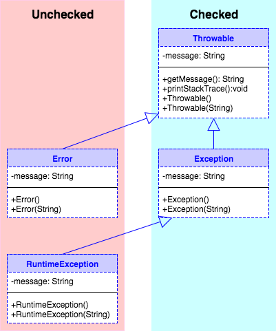

## The `Throwable` Hierarchy

All exceptions descend from the `Throwable` class, which extends `Object`.

* Only objects that descend from `Throwable` can be thrown and caught.

A `Throwable` encapsulates a `String` message, and provides methods like `getMessage` and `printStackTrace`.

* `Throwable` defines a constructor that takes a `String` for the message, as do almost all descendant classes.

Java defines three distinct categories of `Throwables`:
* `Exception`
* `RuntimeException`
* `Error`

### `Exception`

`Exception` extends `Throwable` and is the ancestor of all _checked_ exceptions.

Packages define application-specific `Exception` subclasses and descendants whose names describe the condition causing the exception to be thrown.

```java
public class IOException extends Exception { /*...*/ }
```

```java
public class FileNotFoundException extends IOException { /*...*/ }
```

```java
public class FileReader extends InputStreamReader {
    public FileReader(String fileName) throws FileNotFoundException { /*...*/ }
    //...
}
```

* By convention, names of checked exceptions end in `Exception`.

* Subclasses can add new, application-specific fields and methods if they choose.

> #### remember...
> Checked exceptions represent conditions _external_ to a program that well-written code can anticipate and recover from.

### `RuntimeException`

`RuntimeException` extends `Exception`, but is special: it and its subclasses are _unchecked_ exceptions.

```java
public class RuntimeException extends Exception { /*...*/ }
```

```java
class IllegalArgumentException extends RuntimeException { /*...*/ }
```

```java
public class SecurityException extends RuntimeException { /*...*/ }
```

Callers of methods that throw these exceptions can, _but are not required to_, catch or declare them.

```java
SecurityManager sm = new SecurityManager();
sm.checkListen(80);             // throws SecurityException, don't have to catch.
try {
  sm.checkRead("/etc/sudoers"); // throws SecurityException, can catch if we want.
}
catch (SecurityException e) {
  System.out.println(e);
}
```

> #### remember...
> Unchecked exceptions typically represent conditions _internal_ to a program that well-written code can anticipate and either prevent or recover from.

### `Error`

`Error` extends `Throwable`, so is a sibling (not descendant of) `Exception`.

```java
public class Error extends Throwable { /*...*/ }
```

* By convention, error class names end in `Error`, **not** `Exception`.

`Error`s are also unchecked by the compiler - callers of methods that may throw `Error` do not have to catch or declare them.

* This is because even the most well-written program is not expected to recover from an `Error` and continue executing.

Most errors are generated by the JVM itself.

```java
abstract public class VirtualMachineError extends Error { /*...*/ }
```
```java
public class StackOverflowError extends VirtualMachineError { /*...*/ }
```

`Error`s represent conditions from which recovery is likely impossible.

* These include conditions like running out of memory, overflowing the method call stack, trying to run a program with no `main`, or even a bug in the code of the JVM.

* You don't write `try`/`catch` blocks for `Error`s.

> #### remember...
> `Error`s represent conditions from which recovery is likely impossible. You should not attempt to handle them.

---

---

### Drill
> `Exceptions/com.example.exceptions.drills.ErrorDrill`
> * Open _ErrorDrill.java_ and add code to the `callMe` method as the comments describe.
> * What happens when you run `ErrorDrill`?
> * Right-click on the _Console_ view and select _Preferences_.  Un-check _Limit console output_ and run `ErrorDrill` again.

<hr>

[Prev](handlingExceptions-labs.md) -- [Up](README.md) -- [Next](throw.md)

