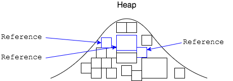

## Garbage Collection

Garbage collection is the process of looking at heap memory, identifying which objects are in use and which are not, and deleting the unused objects.

An object is in use when part of your program still has a reference to it.



### Garbage Collection is Automatic

The JVM handles when and how to do garbage collection; it can happen at any time.

We cannot force a particular object to be garbage collected, but we can request garbage collection.

```java
System.gc();
```

However, `System.gc()` does not guarantee garbage collection will happen - we are only _asking_ the garbage collector to run.

For a small program, garbage collection may never run, as the heap is never filled.

### Garbage Collection is Costly

When garbage collection happens, program performance is heavily degraded, even when using the best of garbage collection strategies.

This harms the application's _throughput_ and _responsiveness_.

> #### throughput
> The amount of work an application can do in a specific amount of time.
>
> Examples:
> * The number of transactions completed in a period of time.
> * The number of web requests handled in an hour.


> #### responsiveness
> How quickly an application responds with a requested piece of data.
>
> Examples:
> * How quickly a tablet's User Interface responds to an event.
> * How fast a website returns a page.

<hr>

[Prev](objects-heap.md) | [Up](README.md) | [Next](gc-strategies.md)

