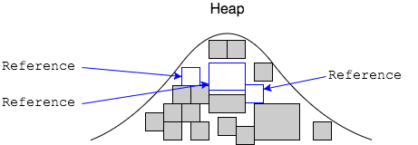
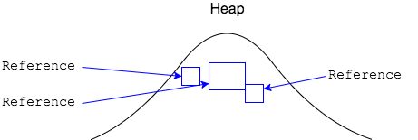

## Memory Management Strategies

There are many strategies for garbage collection.

* Some stop the application and make it wait for collection to complete.

* Others will utilize all of a computer's CPUs to run garbage collection as quickly as possible.

Whatever the strategy, the first step is to mark objects that still have references to them from the running application.

All other objects are considered garbage, and can be deleted.

### Practice Exercise
> Even though the JVM manages memory, we still have to be responsible as programmers, and be careful of needlessly creating objects.

[Prev](garbage-collection.md) -- [Up](README.md) -- [Next](finalize.md)

