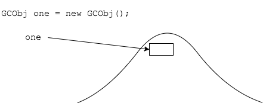
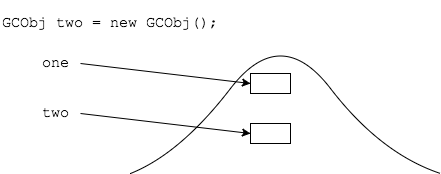
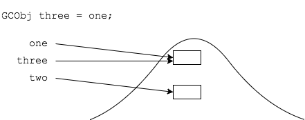
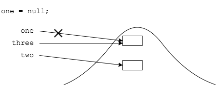
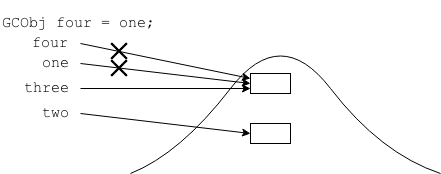
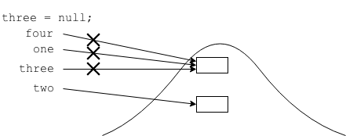
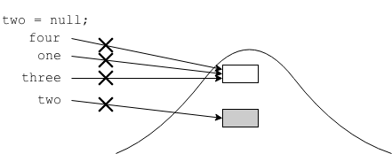
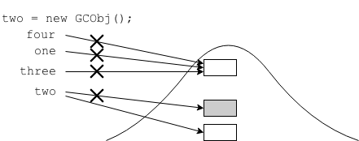

## Lab 1 Solution
After which line is the object created at line `4` eligible for garbage collection?
```java
1: public class GCObj {
2:   public static void main(String[] args) {
3:     GCObj one = new GCObj();
4:     GCObj two = new GCObj();
5:     GCObj three = one;
6:     one = null;
7:     GCObj four = one;
8:     three = null;
9:     two = null;
10:    two = new GCObj();
11:  }
12:}
```

















It is eligible after line `9`.

<hr>

[Prev](labs.md) | [Up](README.md) | [Next](lab2-solution.md)

