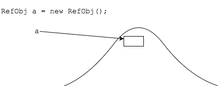
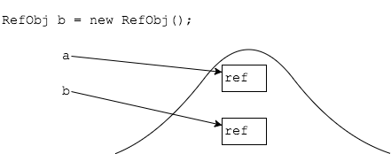
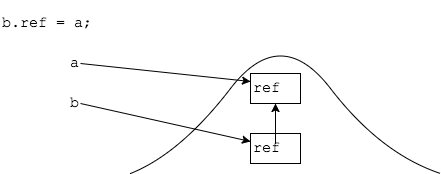
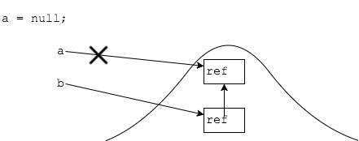
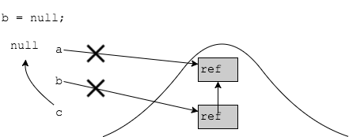

## Lab 1 Solution
After which line is the object at line `6` eligible for garbage collection.
```java
1: public class RefObj {
2:
3:   private RefObj ref;
4:   
5:   public static void main(String[] args) {
6:      RefObj a = new RefObj();
7:      RefObj b = new RefObj();
8:      b.ref = a;
9:      a = null;
10:     RefObj c = a;
11:     b = null;
12:   }
13: }
```












It is eligible when the method finishes.

<hr>

[Prev](lab1-solution.md) -- [Up](README.md)

