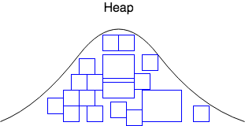

When the JVM starts, memory is allocated for the _heap_.

> #### heap
> A region of the JVM in which memory for new objects is allocated.

As we create objects, the heap fills up.

The heap may grow, but when it becomes full, objects that are no longer used are cleared, making space for new objects.

This process is called _garbage collection_.

### Practice Exercise
> Oracle's JVM sets [defaults for minimum and maximum heap size](https://docs.oracle.com/javase/8/docs/technotes/guides/vm/gctuning/ergonomics.html), based on the type of machine. You can override these with the `-Xms` and  `-Xmx` commands.

[Prev](README.md) -- [Up](README.md) -- [Next](garbage-collection.md)

