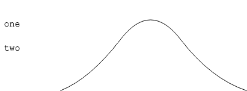
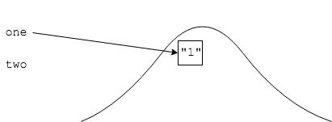
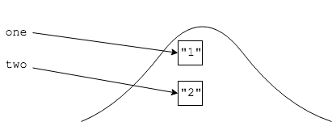
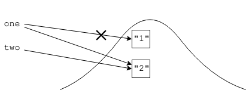
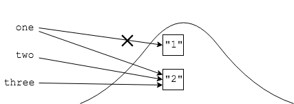
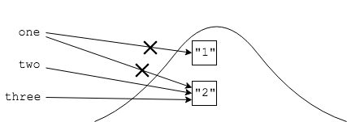

Garbage collection is an important topic in Java, and can come up in interviews and exams.

* A candidate will be asked when a certain object in a method can be garbage collected.

Consider the following code.

```java
// After which line is the object created at line 5
// eligible for garbage collection?
3:  public static void main(String... args){
4: 	 String one, two;
5:	 one = new String("1");
6:	 two = new String("2");
7:	 one = two;
8:	 String three = one;
9:	 one = null;
10: }
```

The best way to handle this question is to draw it on paper or a whiteboard:

* Draw the heap, and as an object is created and assigned to a reference, draw arrows between the two.

* As references change, cross out the arrows and redraw as necessary.

An object is eligible for garbage collection once it no longer has arrows pointing to it from outside the heap.

### Garbage Collection Example
We will go through an example, line by line.
```java
// After which line is the object created at line 5
// eligible for garbage collection?
3:  public static void main(String... args){
4: 	 String one, two;
5:	 one = new String("1");
6:	 two = new String("2");
7:	 one = two;
8:	 String three = one;
9:	 one = null;
10: }
```
First, line 4:
```java
4: String one, two;
```
Draw the reference variables:

```java
5: one = new String("1");
```
For each `new`, draw the object in the heap and connect its reference:

```java
6: two = new String("2");
```

```java
7: one = two;
```
This means that `one` no longer points to the the previous object, instead now pointing to whatever `two` points to:



The arrow (reference) to `"1"` was broken at line `7`.

* No references point to `"1"` so it is eligible for garbage collection after line `7`.

The rest of the example:
```java
8: String three = one;
```

```java
9: one = null;
```


`"2"` is not eligible for garbage collection until the method finishes.

<hr>

[Prev](finalize.md) -- [Up](README.md) -- [Next](labs.md)

