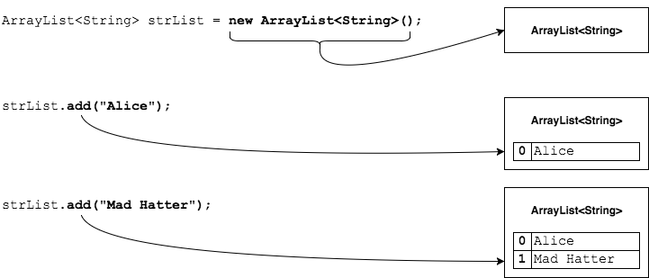
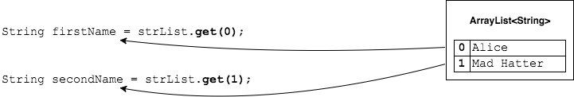

## ArrayList - Adding and Getting
We do not use the `[]` operator with `ArrayList`.

Instead, we invoke methods on the `ArrayList` object.

### `boolean add(E)`
The `ArrayList` below holds `String`s, so we can add `String` objects.
```java
ArrayList<String> strList = new ArrayList<String>();
strList.add("Alice");
strList.add("Mad Hatter");
```

Each element is added at the end of the list.
* As we add, the size of the list grows.
* We do not have to worry about adding past the end of the list.




### Practice Exercise
> `add(E)` returns a `boolean`, which is always `true`.
>
> This doesn't really matter for this class, but there are other classes and interfaces where the value may be `false`.

### `E get(index)`
We can get elements from the list by their zero-based index.

```java
String firstName = strList.get(0);
String secondName = strList.get(1);
```




We DO have to consider the number of items in the list, though - like when we use arrays.
* Trying to `get` an index that is negative or too large results in an `IndexOutOfBoundsException`.

```java
String thirdName = strList.get(2);  // IndexOutOfBoundsException
```

### `int size()`
We can check the number of elements in an `ArrayList` with the `size()` method.

```java
int numElements = strList.size();
System.out.println(numElements);   // 2
```


### Drill
> `GenericsAndArrayList/com.example.generics.drills.AddingAndGetting`
>
> Follow the instructions in comments to practice using `ArrayList`s.

<hr>

[Prev](parameterized-types.md) -- [Up](README.md) -- [Next](replacing-inserting-removing.md)

