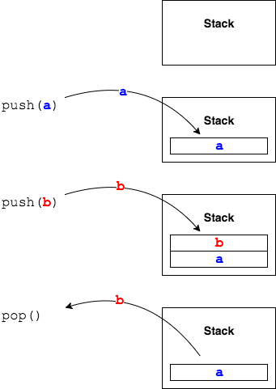

## Labs
In these labs we will use `ArrayList` to store and retrieve data, and as the internal storage for a data structure.

1. Write a program that contains an `ArrayList` of the names of the students in your class. Use a foreach loop to print out each name. (Do not copy-paste from an example.)

   (Solution: _Students.java_)

2. Write a program that uses `Math.random()` to build an `ArrayList` of 10 numbers between `0` and `1` (exclusive). Use a standard `for` loop to print out each number to 3 decimal places. (Hint: `System.out.printf`)

   (Solution: _Numbers.java_)

3. `com.example.generics.drills.Stack`

   In this lab we will create a data structure called a _Stack_. This will be a last-in-first-out (LIFO) stack. This means the last element added is the first one removed. (Think of a stack of dishes: one person adds a dish to the stack, the next person takes that dish off the top of stack.)

   We can say that we _push_ and item on the stack, and _pop_ an item from the stack.

   

   The class `com.example.generics.drills.Stack` uses `Object`s. We will be changing it to a generic class.

   Internally, your `Stack<E>` will use an `ArrayList<E>`.

   The `Stack` has four methods.
   * `E push(E item)` - add an item to the Stack. Return a reference to the item.
   * `E pop()` - remove and return the item at the top of the Stack, or `null` if the Stack is empty.
   * `E peek()` - return the item at the top of the Stack, but do not remove it. Return `null` if the Stack is empty.
   * `int search(Object o)` - search for the item in the Stack by iterating through the list and calling `item.equals(o)`. Return the index of the item, or -1 if it is not in the Stack.

   Refer to [Generic \<Types\>](parameterized-types.md) for a reminder on using the type parameter. (You may want to complete the class to hold `Object` references, then add in `<E>` and `E`.)

   (Note: There are JUnit tests for the solution in the `test/com.example.generics.solutions` package. You could copy these into the `test/com.example.generics.drills` package to test your own class. Be sure the test is using your class, and not the one from the `solutions` package.)

   (Solution: _Stack.java_, _StackTests.java_)

[Prev](arraylist-size.md) | [Up](README.md)

