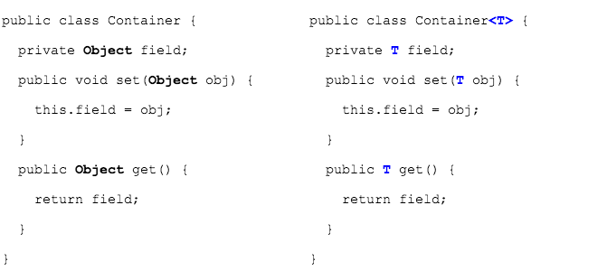
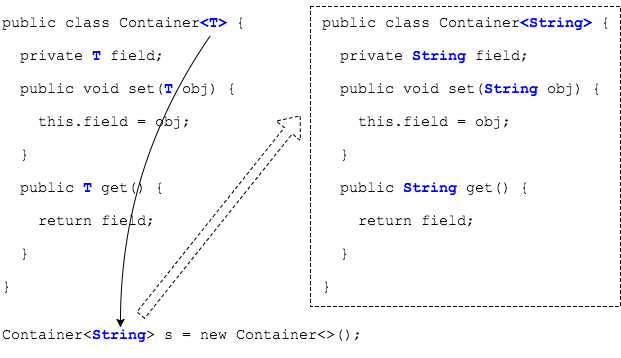

## Generic `<Types>`
We use the `<>` type argument with `ArrayList` because `ArrayList` is a _generic type_.

> #### generic type
> A generic class or interface that is parameterized over types.
>
> This means we can tell the class what types it can use with `<>`.

To explain this concept, we will use this `Container` class.

```java
public class Container {
  private Object field;

  public void set(Object obj) {
    this.field = obj;
  }

  public Object get() {
    return field;
  }
}
```

Since this simple collection's methods use `Object` references, we can pass any type of non-primitive.
* However, there is no way to ensure at compile time that we're using the right types.
  * One part of the code might `set` a `String`, while another part might expect to `get` a `Character`.

### Defining a Generic Type

We can redefine the `Container` class as a _generic_ type.

```java
public class Container<T> {
  private T field;

  public void set(T obj) {
    this.field = obj;
  }

  public T get() {
    return field;
  }
}

```

We've just given the class a type identifier, `<T>`, and replaced each occurrence of `Object`.




When we declare a variable and pass the type parameter, it is like the class definition changes _for this instance_.



With the (imaginary) redefined methods, the compiler guarantees this class will _only_ work with `String`s.

Creating an instance of a generic type is generally known as a _parameterized type_.

### Practice Exercise
> A major benefit of using generics is that the compiler checks the code, so users can be certain of the type the collection holds.
>
> If a developer tries to use wrong type, the compiler catches it.
>
> Fixing compile-time errors is easier than fixing runtime errors, which can be hard to find.

<br >

### Drill
> `GenericsAndArrayList/com.example.generics.drills.Container`
>
> * Change `Container` to a generic type, using the type `E` (for _element_) instead of `T`. (You could use any valid identifier here.)
>
>`GenericsAndArrayList/com.example.generics.drills.GenericContainer`
> * Declare and instantiate a `Container` to hold a `Character` object.
> * Call the object's `set` method and pass in a `'A'`.
> * `get` the `Character` from the object and pass it to `printChar`.
> * Try to `set` an `Integer` or `String` into the object.
>   * Comment this out when you see the compiler error.
> * Create an `ArrayList` to hold `Integer` objects.
> * Optional: can you create an `ArrayList` to hold `Container<Character>` objects?

<hr>

[Prev](arraylist.md) -- [Up](README.md) -- [Next](adding-getting.md)

