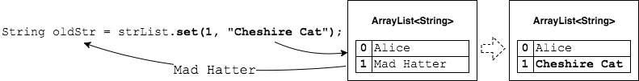
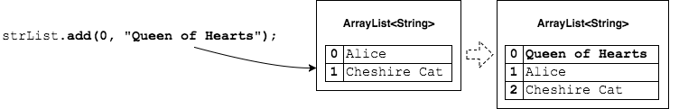
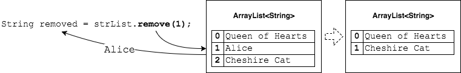

## Replacing, Inserting, and Removing
We can do more than just add to the end of a list with `add(E)`, or see what is at an index with `get(index)`.

We can change what is in the `ArrayList`.

### `E set(index, E)` to Replace
This method replaces the current item at an index...

**and** returns the object reference that was there (just in case we want to use it).

```java
ArrayList<String> strList = new ArrayList<String>();
strList.add("Alice");
strList.add("Mad Hatter");

String oldStr = strList.set(1, "Cheshire Cat");
System.out.println(oldStr);   // Mad Hatter
```



### `void add(index, E)` to Insert
This method adds the element at the given index...

**and** shifts any other objects one space lower in the list.
* Think of it like an insert.

```java
strList.add(0, "Queen of Hearts");
```





### `E remove(index)` to Delete
This method removes the object at the given index...

**and** returns it (just in case we want to use it)...

**and** shifts all subsequent elements up one spot.

```java
String removed = strList.remove(1);
System.out.println(removed); // Alice
```



The size of the `ArrayList` decreases by one - there is no empty space at the end.


### Drill
> `GenericsAndArrayList/com.example.generics.drills.ChangingArrayList`
>
> * In this drill you will follow steps to change the contents of an `ArrayList<String>`.
> * After each change, you will print out the entire list with `System.out.println`.
> * When all changes are correct, a message prints after the list output.

<br >

### Practice Exercise
> `ArrayList` has a nice `toString()`, which iterates through the elements of the list and calls each object's `toString()` method.
>
> As we have seen, a regular array does not have a nice `toString()`.

<hr>

[Prev](adding-getting.md) | [Up](README.md) | [Next](array-vs-arraylist.md)

