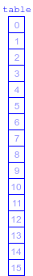
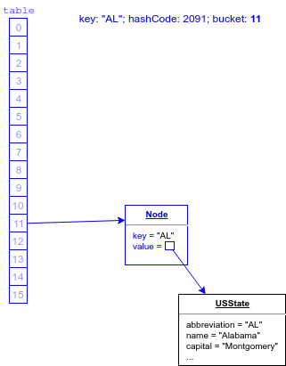
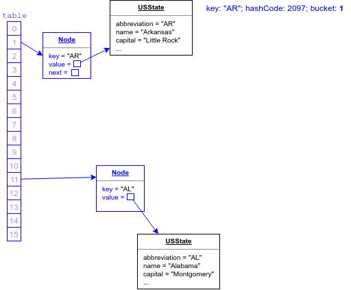

## Hash Buckets

A `HashMap` object maintains an internal array called a _hash table_ containing references to _map entries_ (sometimes called _nodes_.)

* A map entry has references to a key and its stored value, and can also link to another entry.

* By default, the initial size of a `HashMap`'s hash table array is 16.

  

We call the slots in the hash table array _buckets_, because each can hold multiple map entries.

### Choosing a Bucket
The modulus of the key's hash code by the size of the hash table array determines a map entry's bucket.

```
int bucketIndex = key.hashCode() % array.length;
```

* Each string in this list of state abbreviations has a unique hash code; taking the hash code modulo 16 divides them into 16 buckets:

  ```
  "AL": hashCode=2091, mod16=11  // Bucket 11
  "AK": hashCode=2090, mod16=10  // Bucket 10
  "AZ": hashCode=2105, mod16=9   // Bucket 9
  "AR": hashCode=2097, mod16=1   // Bucket 1
  "CA": hashCode=2142, mod16=14
  "CO": hashCode=2156, mod16=12
  "CT": hashCode=2161, mod16=1
  "DE": hashCode=2177, mod16=1
  ...
  "WA": hashCode=2762, mod16=10
  "WV": hashCode=2783, mod16=15
  "WI": hashCode=2770, mod16=2
  "WY": hashCode=2786, mod16=2
  ```

When a new key/value pair is put into a `HashMap`, the map:
1. Calls the key's `hashCode`.
2. Creates a node object with references to the key and the value, as well as a copy of the key's hash code (so it doesn't have to call its `hashCode` again.)
3. Takes the modulus of the hash code by the hash table array's size to determine the array index - which bucket - the node belongs in.
4. Assigns a reference to the new node to the bucket:
   1. If the bucket is empty, it assigns a reference to the node object into that array element.
   2. If there are already any entries in that element, it adds a reference to the new node to the last entry in the bucket.

### Practice Exercise
> Internally, `HashMap` actually does some arithmetic manipulation to determine the hash value for each key, to help ensure even distribution.


```java
Map<String, USState> states = new HashMap<>();
USState state = new USState("AL", "Alabama", "Birmingham", "Dec 14 1819", 4863300);
states.put("AL", state);
```



```java
states.put("AR", new USState("AR","Arkansas","Little Rock","Jun 15 1836",2988248));
```



When we get an entry out of the map, the `HashMap` computes the hash code and thus the bucket of the key we provide, and goes directly to that array index to retrieve the entry.

```java
USState al = states.get("AL");
```

No matter how big the hash table, this computation and retrieval takes the same amount of time.

* The same is true for adding or removing a map entry.

* In contrast, to search for a particular object in a `List` takes longer as the list size increases.

<hr>

[Prev](hashCode.md) | [Up](README.md) | [Next](mapEntry.md)

