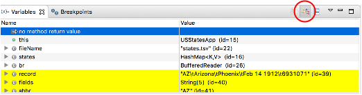
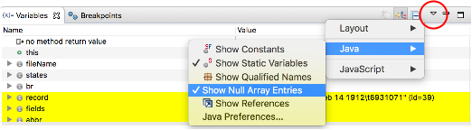

## Labs
In this lab we will use the debugger to examine changes in the `HashMap` class as we add data to it.

Package `HashMapInternals/com.example.hashmap.labs`

1. Open `USStatesApp` and look through the code, making sure you understand it.

   Find the line that constructs a new `USState` object, and set a breakpoint at that line.  Now debug the program using Eclipse's _Debug_ perspective.

   In the _Variables_ view:
   * UN-check the _Show Logical Structures_ button.

     

   * In the _View Menu_, under _Java_, check the _Show Null Array Entries_ option.

     

   In the _Variables_ view find and expand `states` and select its `table` property.  This will be `null` until the first entry is added.  Now use _Step Over_ to advance to the next line.  _Step Over_ again and watch as the `states` `HashMap` initializes its `table` array and its internal state.

   Expand `table` to see the new entry and which bucket it was placed in.  Open up the node to see the `key` and `value` properties.

   Use _Step Out_ to continue execution and loop back to the breakpoint.  Watch the `table` array and the `modCount` field as the next entry is added.  Continue repeating _Step Out_ until the `modCount` reaches `8`.  Expand `table` element `[1]`, and follow the `next` links to see how the `HashMap` linked the entries in bucket 1.

   Continue with _Step Over_ until `modCount` reaches `12`.  When you _Step Out_ to add the next entry, watch how a larger `table` is allocated, and the entries are rehashed to new buckets.  What bucket is `AR` in now?  How about `CT`?

   Continue stepping until `modCount` reaches `24`.  When you step to add the next entry, how big is the new `table`?  Can you find `AR`?

[Prev](loadFactor.md) -- [Up](README.md)

