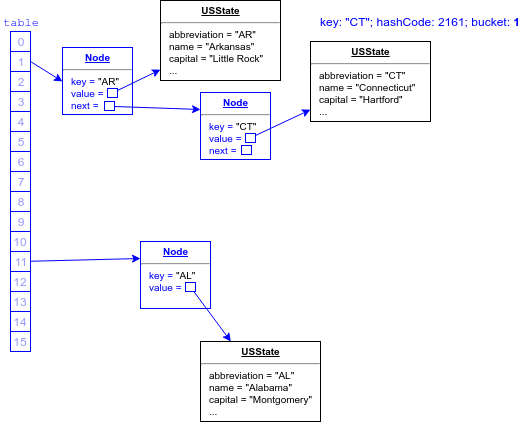
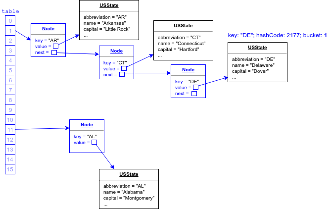

## Map Entries

A `HashMap` may need to store multiple entries (nodes) in a single bucket.

  ```
  "AL": hashCode=2091, mod16=11
  "AK": hashCode=2090, mod16=10
  "AZ": hashCode=2105, mod16=9
  "AR": hashCode=2097, mod16=1   // Bucket 1
  "CA": hashCode=2142, mod16=14
  "CO": hashCode=2156, mod16=12
  "CT": hashCode=2161, mod16=1   // Bucket 1
  "DE": hashCode=2177, mod16=1   // Bucket 1
  ...
  "WA": hashCode=2762, mod16=10
  "WV": hashCode=2783, mod16=15
  "WI": hashCode=2770, mod16=2
  "WY": hashCode=2786, mod16=2
  ```

Each node has a field that can reference another node.

* When the second entry is added to a bucket, its reference is added to the first entry.

  ```java
  states.put("CT", new USState("CT","Connecticut","Hartford","Jan 9 1788",3576452));
  ```
  

As more entries are added to a bucket, they are chained as a linked list from one entry to the next.

```java
states.put("DE", new USState("DE","Delaware","Dover","Dec 7 1787",952065));
```



The more entries in a bucket, the less efficient retrieval becomes.

* To find the entry with the key `DE`, the `HashMap` computes the bucket, but then must visit each bucket entry starting with the first until it finds the key.


<hr>

[Prev](buckets.md) | [Up](README.md) | [Next](loadFactor.md)

