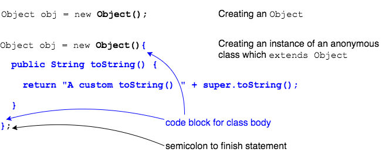

## Anonymous Classes

```java
public class OuterWithAnonymous {
  public void aMethod() {
    Object obj = new Object() {     // Anonymous class overriding
                                    // Object's toString() method
      public String toString() {
        return "A custom toString() " + super.toString();
      }
    };

    System.out.println(obj);
  }
}
```

> #### anonymous class
> A kind of local inner class that combines the class definition with the object instantiation.

Anonymous classes are class definitions that override or implement behavior, and are instantiated immediately.
* The class definition does not have `class Name`, so it is _anonymous_.

Anonymous classes are used in expressions such as method calls or assignments.

### Declaring and Using Anonymous Classes

Declare and use an anonymous class by providing a code block after a constructor call, but before the semicolon.




In general, we declare and instantiate an anonymous instance using the code below.
```java
new Name( [arguments] ) {
  //class definition
}
```

* If `Name` is a class name, then the anonymous class `extends` that class and can provide constructor arguments.

* If `Name` is an interface name, then the anonymous class `implements` that interface.


### Anonymous Class Rules
Methods of local (including anonymous) classes can only use variables:

  * Declared in its enclosing scope `{}` (usually the method body).

  * Declared as parameters to the method.

  * **AND** declared as `final` or effectively final (not changed after initialization) in the local class's enclosing scope - the enclosing method or block.

Anonymous classes can access members of the enclosing class.

```java
// Anonymous Inner Class
public class Outer3 {
  private int outerField;

  public void aMethod() {
    final int localVar = 0;

    Object in = new Object() { // Assignment statement starts here...
      private int innerField;

      public String toString() {
        return "o: " + outerField + " i: " + innerField
            + " l: " + localVar;
      }
    }; // <-- Note the semicolon to end the assignment statement.

    System.out.println(in);
  }

  public static void main(String[] args) {
    Outer3 out = new Outer3();
    out.aMethod();
  }
}
```

<br >

### Practice Exercise
> Anonymous classes are compiled into bytecode files named `EnclosingClass$n`, where `n` is a counter for anonymous classes in `EnclosingClass`. We don't use `$` in identifiers to avoid name collisions.

<hr>

[Prev](LocalClasses.md) -- [Up](README.md) -- [Next](anonymousAndInterfaces.md)

