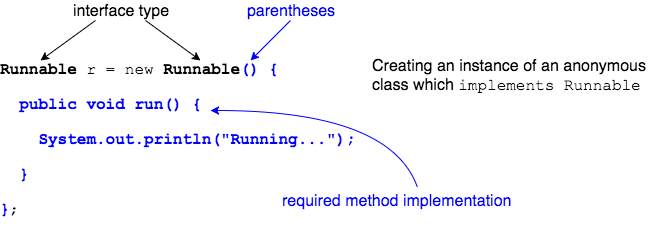
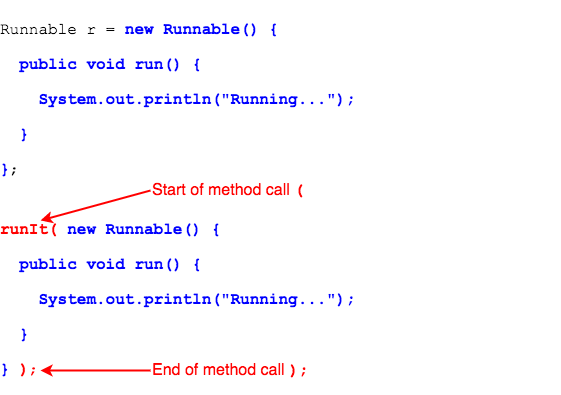

## Anonymous Classes and Interfaces
Using anonymous classes with interfaces is different than a class, because the anonymous class is _implementing_ the interface.

* The variable type will be the interface.
* Use `()` after the interface name, like calling a constructor (even though there is no such thing as an interface constructor).
* Implement all abstract methods in the anonymous class's body.

### Implementing the Interface

Consider this interface, from `java.lang`.

```java
public interface Runnable {
  public abstract void run();
}
```

To implement this interface, classes must implement a `run()` method.

```java
// Top-level class
public class RunnableClass implements Runnable {

  public void run() {
    System.out.println("Running...");
    // ...
  }

}
```

An anonymous `Runnable` implementation looks like:

```java
Runnable r = new Runnable() {
  public void run() {
    System.out.println("Running...");
  }
};
```



### Passing an Anonymous Instance in a Method Call

The method below takes a `Runnable` method parameter.

```java
public void runIt(Runnable r) {
  r.run();
}
```

We can pass an anonymous instance when we call the method.

```java
runIt(new Runnable() {

  public void run() {
    System.out.println("Running...");
  }

});

```

We simply passed the class definition and instantiation to the method.




If we have a method that takes a generic type, like `java.util.Comparator<T>`, we add the type before `()`.

This method takes a `List<Planet>` and `Comparator<Planet>`.

```java
public void compareIt(List<Planet> planets, Comparator<Planet> p) {
  // ...
}
```

We pass the `List` and the anonymous `Comparator`.

```java
compareIt(planets, new Comparator<Planet>() {

  @Override
  public int compare(Planet o1, Planet o2) {
    int result = 0;
    // ...
    return result;
  }
});
```


### Drill
> `InnerClasses/com.example.innerclasses.drills.PrintSortedPlanetsAnonymous`
>
> * Change this class to pass an anonymous `Comparator<Planet>` instead of a member class instance.
>
> (Solution: _PrintSortedPlanetsAnonymous.java_)

<hr>

[Prev](AnonymousClasses.md) -- [Up](README.md) -- [Next](InstanceInitializers.md)

